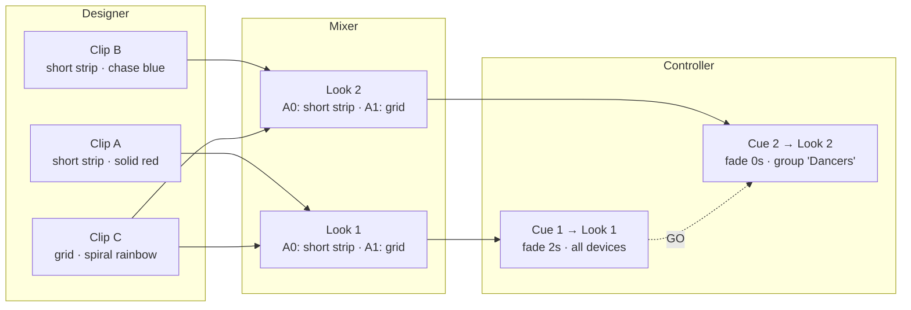

# PrimusV3

WiFi-controlled LED lighting system for live performance costumes. A Python sender drives ESP32-S3 receiver nodes over Art-Net.

## How It Works

```
┌──────────────┐    Art-Net UDP    ┌──────────────────┐
│  Sender      │  ──────────────►  │  Receiver Node   │
│  (Python)    │    port 6454      │  (ESP32-S3)      │
│              │  ◄──────────────  │                  │
│  Web UI      │   FPS telemetry   │  3× NeoPixel out │
│              │    port 6455      │  TFT display     │
└──────────────┘                   └──────────────────┘
```

The sender runs a web UI with a built-in effects engine. It computes animation frames and sends pixel data over Art-Net to one or more receiver nodes on the same WiFi network. Each node drives up to 3 NeoPixel outputs through level-shifted NeoPXL8.

## Versions

### V3.1 (Active)

Modular Python sender with a full clip/look workflow for live performance. The sender is split into focused modules and the web UI uses Alpine.js with separate HTML/CSS/JS files.

Key features:
- **Clip Designer** — Prototype effects per-output with live preview, save as reusable clips
- **Clip Library** — 100+ preset clips with animated hover preview, search, and per-output-type filtering
- **Look Mixer** — Timeline-based editor to arrange clips into sequenced Looks with crossfades, drag-to-place, and segment resizing
- **Look Controller** — Trigger saved Looks during live performance with cue list playback
- **Device Groups** — Organize receiver nodes into named groups
- **Playback modes** — Loop, boomerang, once — per-clip and per-look
- **Audio panel** — Browse and trigger WAV files on V3.2 audio nodes, with live volume control

### Workflow: Clips → Looks → Cues

Each receiver node has 2 outputs (A0 and A1), and each output can be independently set to any of the 3 light types: short strip (30px), long strip (72px), or grid (8×8). A clip targets one output type, and a look assigns clips to both outputs — so a single look can mix different light types (e.g. A0: short strip, A1: grid).

Content is built up in three layers:

- **Clips** — The smallest unit. A single effect (colors, speed, playback) designed for one output type. Created in the Designer.
- **Looks** — A timeline arrangement of clips across both outputs, defining what every port displays simultaneously. Built in the Mixer.
- **Cues** — Sequence looks for live performance with crossfade timing, auto-follow, and per-device/group targeting. Run from the Controller.



### V3.2 Audio Receiver (In Development)

A firmware-only variant of V3.1 that adds WAV audio playback and FTP file management. No V3.2 sender exists yet — audio nodes receive the same Art-Net LED data as V3.1 nodes, with two additional custom opcodes for audio and FTP control.

New in V3.2:
- **WAV playback** triggered by Art-Net opcode `0x8200` — commands: play, loop, stop, pause, and live volume (cmd 4, no file restart)
- **FTP server** on TCP port 21 for uploading/managing audio files on the SD card, controlled by Art-Net opcode `0x8201` or the D1 button on the FTP screen
- **Dual audio board support** — compile-time switch in `config.h` between Adafruit Music Maker FeatherWing (VS1053 SPI codec) and Adafruit Audio BFF (MAX98357 I2S)
- **SD bus safety** — FTP and audio share the SD card; audio automatically stops FTP before playing, and FTP refuses to start while audio is active
- **Sender UI integration** — V3.1 sender detects V3.2 nodes (via `is_audio` flag in ArtPollReply), shows a ♪ badge on device cards, and exposes an Audio tab for file browsing and playback control

---

## Quick Start

### Sender (V3.1)

```bash
python3 V3_1/sender/run.py
```

Opens a web UI at the printed URL (auto-selects an available port). No external dependencies — Python 3 stdlib only.

```bash
python3 V3_1/sender/run.py --port 8080        # specify port
python3 V3_1/sender/run.py --no-browser        # don't auto-open browser
```

### Firmware

```bash
cd V3_1/Arduino
./upload.sh
```

Requires [arduino-cli](https://arduino.cc/pro/cli). The script auto-detects the board, installs libraries, compiles, and uploads. See `./upload.sh --help` for options.

```bash
./upload.sh --compile    # compile only, no upload
./upload.sh --install    # install required libraries only
./upload.sh /dev/cu.usbmodem14101  # specify port manually
```

## Hardware

- **Board:** [Adafruit ESP32-S3 Reverse TFT Feather](https://www.adafruit.com/product/5691)
- **LED driver:** NeoPXL8 (level-shifted, 3 outputs on GPIO 16/17/18 → A2/A1/A0)
- **Display:** Built-in 240×135 ST7789 TFT — shows device name, WiFi status, IP, RSSI, live FPS
- **Buttons:** D0 cycles display screens, D1 toggles test mode

**Additional hardware for V3.2 audio nodes (one of):**
- **Adafruit Music Maker FeatherWing** (VS1053B SPI codec, Adafruit #3357) — plays WAV/MP3/OGG via SPI, includes SD slot
- **Adafruit Audio BFF** (MAX98357 I2S amp, Adafruit #5769) — I2S DAC/amp, SD card via SPI

Audio board is selected at compile time by setting `AUDIO_BOARD` in `config.h`.

### Output Types

| Type | Pixels | Layout |
|------|-------:|--------|
| Off | 0 | — |
| Short Strip | 30 | Linear |
| Long Strip | 72 | Linear |
| Grid 8×8 | 64 | Serpentine |

Output types are configurable at runtime from the web UI — no reflashing needed. Each node supports up to 3 outputs (one per port), each independently assignable.

## Effects

| Effect | Works On |
|--------|----------|
| Solid | All |
| Pulse | All |
| Linear | All |
| Constrainbow | All |
| Rainbow | All |
| Knight Rider | All |
| Chase | All |
| Radial | Grid only |
| Spiral | Grid only |

## Network Protocol

Standard Art-Net 4 over UDP, plus two custom extensions:

| Function | Port | Opcode |
|----------|------|--------|
| LED data (ArtDmx) | 6454 | 0x5000 |
| Discovery (ArtPoll/Reply) | 6454 | 0x2000/0x2100 |
| Device naming (ArtAddress) | 6454 | 0x6000 |
| Output config (custom) | 6454 | 0x8100 |
| Audio command (custom, V3.2) | 6454 | 0x8200 |
| FTP control (custom, V3.2) | 6454 | 0x8201 |
| FPS telemetry (custom) | 6455 | — |
| FTP file transfer (V3.2) | 21 | TCP |

Any Art-Net compatible software (TouchDesigner, MadMapper, etc.) can drive these nodes directly. See [API_REFERENCE.md](API_REFERENCE.md) for full protocol docs.

## Project Structure

```
PrimusV3/
├── V3_2/                            # Audio receiver firmware (in development)
│   └── Arduino/
│       └── primusV3_audio_receiver/
│           ├── primusV3_audio_receiver.ino  # Main sketch (Art-Net + audio + FTP)
│           ├── config.h             # Output types, pins, audio board selection
│           ├── audio.h              # WAV playback (VS1053 or MAX98357 I2S)
│           ├── ftp.h                # FTP server wrapper (SimpleFTPServer)
│           ├── display.h            # TFT display (adds Audio + FTP screens)
│           └── buttons.h            # Button input handling
├── V3_1/                            # Active version
│   ├── sender/
│   │   ├── run.py                   # Entry point
│   │   ├── state.py                 # Core state, animation loop, device mgmt
│   │   ├── server.py                # HTTP server + JSON API
│   │   ├── effects.py               # Effect functions + color utilities
│   │   ├── clips.py                 # Clip CRUD, library, preview engine
│   │   ├── mixer.py                 # Look timeline computation
│   │   ├── controller.py            # Cue list playback
│   │   ├── artnet.py                # Art-Net transport + discovery
│   │   ├── clips/                   # Clip JSON files (100+)
│   │   ├── looks/                   # Saved Look JSON files
│   │   └── web/
│   │       ├── index.html           # Single-page app (Alpine.js)
│   │       ├── css/style.css        # UI styles
│   │       └── js/
│   │           ├── alpine.min.js    # Alpine.js v3.14.9 (vendored)
│   │           ├── app.js           # Shared stores, polling, preview render
│   │           ├── look-mixer.js    # Designer + Timeline + Library component
│   │           └── look-controller.js  # Cue list component
│   └── Arduino/
│       ├── upload.sh                # Build & upload script
│       └── primusV3_receiver/
│           ├── primusV3_receiver.ino
│           ├── config.h
│           ├── display.h
│           └── buttons.h
├── V3_0/                            # Archived original version
│   ├── sender/
│   │   └── led_controller.py       # Single-file sender (~1800 lines)
│   └── Arduino/
│       └── primusV3_receiver/
├── API_REFERENCE.md
├── DEPLOYMENT_STRATEGY.md
├── V3_1Plan.md                      # V3.1 design spec
├── CLAUDE.md
└── .github/
    └── copilot-instructions.md
```

## Adding Output Types

Both sides use lookup tables — add one row each:

**config.h:**
```c
OUTPUT_RING = 4,  // add to OutputType enum
{ "Ring", 24, 3, LAYOUT_LINEAR, 0, 0 },  // add to OUTPUT_TYPE_TABLE
```

**state.py (V3.1) / led_controller.py (V3.0):**
```python
"ring": {"pixels": 24, "layout": "linear"},  # add to OUTPUT_TYPES
LOOK_OUTPUT_TYPES = ["none", "short_strip", "long_strip", "grid", "ring"]
# Index must match enum value
```

## License

Private — not for redistribution.

## V3.0 (Archived)

Single-file Python sender (`led_controller.py`, ~1800 lines) with the HTTP server, Art-Net engine, effects engine, and full HTML/CSS/JS web UI embedded as string literals. Functional for direct effect control but no clip/look workflow. Kept in `V3_0/` for reference.

```bash
python3 V3_0/sender/led_controller.py
```
