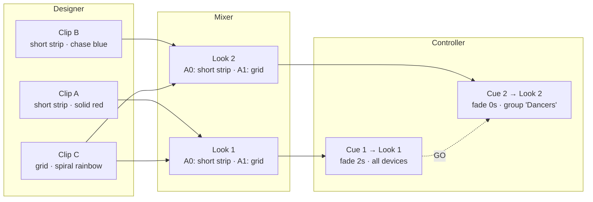

# PrimusV3

WiFi-controlled LED lighting system for live performance costumes. A Python sender drives ESP32 receiver nodes over Art-Net.

## How It Works

```
┌──────────────┐    Art-Net UDP    ┌──────────────────┐
│  Sender      │  ──────────────►  │  Receiver Node   │
│  (Python)    │    port 6454      │  (ESP32-S3)      │
│              │  ◄──────────────  │                  │
│  Web UI      │   FPS telemetry   │  2× NeoPixel out │
│              │    port 6455      │  TFT display     │
└──────────────┘                   └──────────────────┘
```

The sender runs a web UI with a built-in effects engine. It computes animation frames and sends pixel data over Art-Net to one or more receiver nodes on the same WiFi network. The current V3.5 track supports reflashed V1, V2, and V3.1 hardware through one shared Art-Net protocol.

## Versions

### V3.5 (Current Compatibility Track)

V3.5 builds on V3.1 to run reflashed V1, V2, and V3.1 receiver hardware from the same current Art-Net sender/controller protocol. It uses one shared firmware source tree with board profiles for V1 Huzzah32, V2 ESP32 Feather, and V3.1 ESP32-S3 Reverse TFT hardware.

Main updates:
- One active V3.5 sender under `V3_5/sender/` with the clip/look/cue workflow from V3.1.
- One active receiver firmware tree under `V3_5/Arduino/primusV3_receiver/` with compile-time profiles for `v1`, `v2`, and `v3_1`.
- New output types for legacy hardware: `small_grid` (4x8 / 32 px) and `extra_long_strip` (122 px).
- Discovery now advertises hardware profile metadata with `PV3CAP1|...|B:<profile>|F:RIOH`.
- V1 and V2 screenless boards have connection indicators: V1 uses `LED_BUILTIN`; V2 uses the onboard NeoPixel.
- Plain `run.py` launch replaces any previous V3.5 sender and opens one dedicated Primus browser window.

Launch the V3.5 interface:

```bash
python3 V3_5/sender/run.py
```

The default URL is `http://127.0.0.1:8080`. If 8080 is busy, the sender falls back to an auto-selected port and prints the URL. Use `--no-browser` for automated checks and `--port 0` when you explicitly want an auto-selected port.

Upload V3.5 firmware:

```bash
./V3_5/Arduino/upload.sh --board v1 --compile
./V3_5/Arduino/upload.sh --board v2 --compile
./V3_5/Arduino/upload.sh --board v3_1 --compile

./V3_5/Arduino/upload.sh --board v1 /dev/cu.usbserial-XXXX
./V3_5/Arduino/upload.sh --board v2 /dev/cu.usbserial-XXXX
./V3_5/Arduino/upload.sh --board v3_1 /dev/cu.usbmodemXXXX
```

Useful upload flags:

| Flag | Use |
| --- | --- |
| `--board v1`, `--board v2`, `--board v3_1` | Select the hardware profile. Defaults to `v3_1`. |
| `--compile` | Compile only; do not upload. |
| `--install` | Check/install required Arduino libraries for the selected board. |
| `--baud <rate>` / `--speed <rate>` | Override upload speed. |
| `/dev/cu...` | Explicit serial port when multiple boards are connected. |

Start here for V3.5 development:
- [V3_5/README.md](V3_5/README.md) - documentation index and quick start
- [V3_5/FIRMWARE_DEVELOPMENT.md](V3_5/FIRMWARE_DEVELOPMENT.md) - firmware profiles, pins, protocol contracts, and validation
- [V3_5/SENDER_DEVELOPMENT.md](V3_5/SENDER_DEVELOPMENT.md) - sender architecture, discovery parsing, API behavior, and tests
- [V3_5/hardwareCompatibility.md](V3_5/hardwareCompatibility.md) - compact board/profile/pin/output reference

### V3.1 (Previous Modular Track)

Modular Python sender with a full clip/look workflow for live performance. The sender is split into focused modules and the web UI uses Alpine.js with separate HTML/CSS/JS files.

Key features:
- **Clip Designer** — Prototype effects per-output with live preview, save as reusable clips
- **Clip Library** — 100+ preset clips with animated hover preview, search, and per-output-type filtering
- **Look Mixer** — Timeline-based editor to arrange clips into sequenced Looks with crossfades, drag-to-place, and segment resizing
- **Look Controller** — Trigger saved Looks during live performance with cue list playback
- **Device Groups** — Organize receiver nodes into named groups
- **Playback modes** — Loop, boomerang, once — per-clip and per-look

### Workflow: Clips → Looks → Cues

Each receiver node has 2 outputs (A0 and A1), and each output can be independently set to any of the 3 light types: short strip (30px), long strip (72px), or grid (8×8). A clip targets one output type, and a look assigns clips to both outputs — so a single look can mix different light types (e.g. A0: short strip, A1: grid).

Content is built up in three layers:

- **Clips** — The smallest unit. A single effect (colors, speed, playback) designed for one output type. Created in the Designer.
- **Looks** — A timeline arrangement of clips across both outputs, defining what every port displays simultaneously. Built in the Mixer.
- **Cues** — Sequence looks for live performance with crossfade timing, auto-follow, and per-device/group targeting. Run from the Controller.


```mermaid
flowchart LR
    subgraph Designer
        C1[Clip A\nshort strip · solid red]
        C2[Clip B\nshort strip · chase blue]
        C3[Clip C\ngrid · spiral rainbow]
    end
    subgraph Mixer
        L1["Look 1\nA0: short strip · A1: grid"]
        L2["Look 2\nA0: short strip · A1: grid"]
    end
    subgraph Controller
        Q1[Cue 1 → Look 1\nfade 2s · all devices]
        Q2[Cue 2 → Look 2\nfade 0s · group 'Dancers']
    end
    C1 --> L1
    C3 --> L1
    C2 --> L2
    C3 --> L2
    L1 --> Q1
    L2 --> Q2
    Q1 -.->|GO| Q2
```

## Quick Start

### Sender (V3.5)

```bash
python3 V3_5/sender/run.py
```

Opens the V3.5 web UI at `http://127.0.0.1:8080` unless that port is busy. No external dependencies — Python 3 stdlib only.

```bash
python3 V3_5/sender/run.py --port 8080         # specify port
python3 V3_5/sender/run.py --port 0            # force auto-selected port
python3 V3_5/sender/run.py --no-browser        # don't auto-open browser
```

### Firmware (V3.5)

```bash
./V3_5/Arduino/upload.sh --board v3_1
```

Requires [arduino-cli](https://arduino.cc/pro/cli). The script installs/checks required libraries, compiles, and uploads. Add an explicit serial port when multiple boards are connected.

```bash
./V3_5/Arduino/upload.sh --board v1 --compile
./V3_5/Arduino/upload.sh --board v2 --install
./V3_5/Arduino/upload.sh --board v3_1 /dev/cu.usbmodem14101
```

## Hardware

- **V1:** Adafruit Huzzah32 ESP32 Feather, direct NeoPixel outputs on GPIO32/GPIO12, `LED_BUILTIN` WiFi indicator
- **V2:** Adafruit ESP32 Feather V2, direct NeoPixel outputs on GPIO32/GPIO12, onboard NeoPixel WiFi indicator
- **V3.1:** Adafruit ESP32-S3 Reverse TFT Feather + NeoPXL8 FeatherWing fixed outputs 6 and 7 on GPIO14/GPIO15 (A4/A3), TFT status display

### Output Types

| Type | Pixels | Layout |
|------|-------:|--------|
| Off | 0 | — |
| Short Strip | 30 | Linear |
| Long Strip | 72 | Linear |
| Grid 8×8 | 64 | Serpentine |
| Small Grid 4×8 | 32 | Serpentine |
| Extra Long Strip | 122 | Linear |

Output types are configurable at runtime from the web UI — no reflashing needed. V3.5 receiver profiles expose 2 independently assignable outputs (A0 and A1).

## Effects

| Effect | Works On |
|--------|----------|
| Solid | All |
| Pulse | All |
| Linear | All |
| Constrainbow | All |
| Rainbow | All |
| Knight Rider | All |
| Chase | All |
| Radial | Grid only |
| Spiral | Grid only |

## Network Protocol

Standard Art-Net 4 over UDP, plus custom extensions for output and IP configuration:

| Function | Port | Opcode |
|----------|------|--------|
| LED data (ArtDmx) | 6454 | 0x5000 |
| Discovery (ArtPoll/Reply) | 6454 | 0x2000/0x2100 |
| Device naming (ArtAddress) | 6454 | 0x6000 |
| Output config (custom) | 6454 | 0x8100 |
| Static IP config (custom) | 6454 | 0x8200 |
| FPS telemetry (custom) | 6455 | — |

Discovery also carries a PrimusV3 capability tag in ArtPollReply Node Report: `PV3CAP1|port:type_id:universe|B:profile|F:RIOH`. The sender uses that to identify hardware profile and decide whether a node explicitly advertises rename, hello, IP-config, and output-config support, while still falling back to legacy Primus behavior for older firmware.

Any Art-Net compatible software (TouchDesigner, MadMapper, etc.) can drive these nodes directly. See [API_REFERENCE.md](API_REFERENCE.md) for full protocol docs.

## Project Structure

```
PrimusV3/
├── V3_5/                            # Current compatibility track for V1/V2/V3.1 hardware
│   ├── README.md                    # V3.5 documentation index
│   ├── FIRMWARE_DEVELOPMENT.md      # Firmware profile and protocol notes
│   ├── SENDER_DEVELOPMENT.md        # Sender architecture and API notes
│   ├── hardwareCompatibility.md     # Board, pin, and output type reference
│   ├── Arduino/
│   ├── sender/
│   └── previousHardware/            # Archived V1/V2 reference firmware/specs
├── V3_1/                            # Previous modular version
│   ├── sender/
│   │   ├── run.py                   # Entry point
│   │   ├── state.py                 # Core state, animation loop, device mgmt
│   │   ├── server.py                # HTTP server + JSON API
│   │   ├── effects.py               # Effect functions + color utilities
│   │   ├── clips.py                 # Clip CRUD, library, preview engine
│   │   ├── mixer.py                 # Look timeline computation
│   │   ├── controller.py            # Cue list playback
│   │   ├── artnet.py                # Art-Net transport + discovery
│   │   ├── clips/                   # Clip JSON files (100+)
│   │   ├── looks/                   # Saved Look JSON files
│   │   └── web/
│   │       ├── index.html           # Single-page app (Alpine.js)
│   │       ├── css/style.css        # UI styles
│   │       └── js/
│   │           ├── alpine.min.js    # Alpine.js v3.14.9 (vendored)
│   │           ├── app.js           # Shared stores, polling, preview render
│   │           ├── look-mixer.js    # Designer + Timeline + Library component
│   │           └── look-controller.js  # Cue list component
│   └── Arduino/
│       ├── upload.sh                # Build & upload script
│       └── primusV3_receiver/
│           ├── primusV3_receiver.ino
│           ├── config.h
│           ├── display.h
│           └── buttons.h
├── V3_0/                            # Archived original version
│   ├── sender/
│   │   └── led_controller.py       # Single-file sender (~1800 lines)
│   └── Arduino/
│       └── primusV3_receiver/
├── API_REFERENCE.md
├── CLAUDE.md
└── .github/
    └── copilot-instructions.md
```

## Adding Output Types

Both sides use lookup tables — add one row each:

**config.h:**
```c
OUTPUT_RING = 6,  // append to OutputType enum
{ "Ring", 24, 3, LAYOUT_LINEAR, 0, 0 },  // add to OUTPUT_TYPE_TABLE
```

**state.py (V3.5):**
```python
"ring": {"pixels": 24, "layout": "linear"},  # add to OUTPUT_TYPES
LOOK_OUTPUT_TYPES = ["none", "short_strip", "long_strip", "grid", "small_grid", "extra_long_strip", "ring"]
# Index must match enum value
```

## License

Private — not for redistribution.

## V3.0 (Archived)

Single-file Python sender (`led_controller.py`, ~1800 lines) with the HTTP server, Art-Net engine, effects engine, and full HTML/CSS/JS web UI embedded as string literals. Functional for direct effect control but no clip/look workflow. Kept in `V3_0/` for reference.

```bash
python3 V3_0/sender/led_controller.py
```
