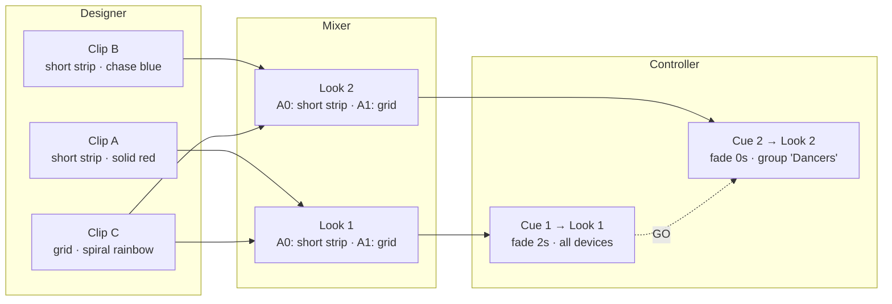

# PrimusV3

WiFi-controlled LED lighting system for live performance costumes. A Python sender drives ESP32 receiver nodes over Art-Net.

## How It Works

```
    Art-Net Sender
┌──────────────────────┐    Art-Net UDP    ┌──────────────────┐
│                      │  ──────────────►  │  Receiver Node   │
│  Python Web UI       │    port 6454      │  (ESP32)         │
│  TouchDesigner       │  ◄──────────────  │                  │
│  Isadora / MaxMSP    │   FPS telemetry   │  2× NeoPixel out │
│                      │    port 6455      │  Status display  │
└──────────────────────┘                   └──────────────────┘
```

The included Python sender runs a web UI with a built-in effects engine. It computes animation frames and sends pixel data over Art-Net to one or more receiver nodes on the same WiFi network. Other Art-Net sources can send LED data directly to the same receivers. The system is intended to run on a dedicated router; the controller computer must be connected to that router by WiFi or Ethernet so it can reach the receiver nodes. The current V3.5 track supports reflashed V1, V2, and V3.1 hardware through one shared Art-Net protocol.

## Versions

### V3.5 (Current Compatibility Track)

V3.5 builds on V3.1 to run reflashed V1, V2, and V3.1 receiver hardware from the same current Art-Net sender/controller protocol. It uses one shared firmware source tree with board profiles for V1 Huzzah32, V2 ESP32 Feather, and V3.1 ESP32-S3 Reverse TFT hardware.

Main updates:
- One active V3.5 sender under `V3_5/sender/` with the clip/look/cue workflow from V3.1.
- One active receiver firmware tree under `V3_5/Arduino/primusV3_receiver/` with upload profiles for `-v1`, `-v2`, and `-v3`.
- New output types for legacy hardware: `small_grid` (8x4 / 32 px) and `extra_long_strip` (122 px).
- Discovery now advertises hardware profile metadata with `PV3CAP1|...|B:<profile>|F:RIOH`.
- V1 and V2 screenless boards have connection indicators: V1 uses `LED_BUILTIN`; V2 uses the onboard NeoPixel.
- Plain `run.py` launch replaces any previous V3.5 sender and opens one dedicated Primus browser window.

First-time setup after installing Python 3:

```bash
python3 setup_primus.py
```

The setup script creates/checks `.venv`, confirms the sender has no external Python package requirements, installs or reuses Arduino CLI, configures the ESP32 Arduino core, and installs/checks the Arduino libraries needed by the V3.5 upload profiles. To inspect an existing machine without installing anything, run:

```bash
python3 setup_primus.py --check
```

Launch the V3.5 interface:

```bash
.venv/bin/python V3_5/sender/run.py
```

You can also use any Python 3 interpreter directly. The default URL is `http://127.0.0.1:8080`. If 8080 is busy, the sender falls back to an auto-selected port and prints the URL. Use `--no-browser` for automated checks and `--port 0` when you explicitly want an auto-selected port.

Upload V3.5 firmware:

Firmware upload requires [Arduino CLI](https://arduino.github.io/arduino-cli/latest/) with the ESP32 board core available. The upload script handles compile/upload commands and can check required libraries with `--install`.

The upload workflow behaves like the Arduino IDE: `--compile` is the verify-only step, while any upload command compiles automatically before flashing the board. You do not need to run `--compile` before `--auto`, `--all`, or an explicit-port upload.

To build firmware for a different router without editing source files, pass WiFi credentials at upload time:

```bash
./V3_5/Arduino/upload.sh -v2 -ssid "PrimusRouter" -pw "router-password" --auto
```

These values override the firmware defaults for that compile/upload run only. Quote SSIDs or passwords that contain spaces or shell-special characters.

First time setting up a computer for board uploads? Start with [BOARD_UPLOAD_README.md](BOARD_UPLOAD_README.md) for the automated setup script, manual fallback commands, Arduino CLI, ESP32 core, library, port-detection, and upload commands.

Recommended upload workflow:

1. List detected ESP32-like serial ports.

    ```bash
    ./V3_5/Arduino/upload.sh --ports
    ```

2. If exactly one receiver is plugged in over USB, let the script choose it.

    ```bash
    ./V3_5/Arduino/upload.sh -v3 --auto
    ```

    `--auto` refuses to guess if no ESP32-like ports are found or if multiple candidates are connected.

3. If multiple receivers of the same hardware profile are plugged in, upload to all detected candidates.

    ```bash
    ./V3_5/Arduino/upload.sh -v2 --all
    ```

    Use this only when every ESP32-like candidate from `--ports` should receive the selected profile.

4. If multiple receiver types are plugged in, pass the target ports explicitly.

    ```bash
    ./V3_5/Arduino/upload.sh -v1 /dev/cu.usbserial-XXXX /dev/cu.usbserial-YYYY
    ./V3_5/Arduino/upload.sh -v2 /dev/cu.usbserial-XXXX /dev/cu.usbserial-YYYY
    ./V3_5/Arduino/upload.sh -v3 /dev/cu.usbmodemXXXX
    ```

Common compile and upload commands:

```bash
./V3_5/Arduino/upload.sh --ports
./V3_5/Arduino/upload.sh -v1 --compile
./V3_5/Arduino/upload.sh -v2 --compile
./V3_5/Arduino/upload.sh -v3 --compile

./V3_5/Arduino/upload.sh -v3 --auto
./V3_5/Arduino/upload.sh -v2 --all
```

Multi-board uploads:

```bash
# Same hardware profile on every detected ESP32-like serial port
./V3_5/Arduino/upload.sh -v2 --all

# Chosen ports only, useful when multiple board types are plugged in
./V3_5/Arduino/upload.sh -v1 /dev/cu.usbserial-XXXX /dev/cu.usbserial-YYYY
```

`--all` compiles once, then uploads sequentially to each selected port. Use `./V3_5/Arduino/upload.sh --ports` first and only use `--all` when every ESP32-like candidate should receive the same `-v1`, `-v2`, or `-v3` firmware profile. For mixed board types, pass the exact ports explicitly.

Useful upload flags:

| Flag | Use |
| --- | --- |
| `-v1`, `-v2`, `-v3` | Select the hardware profile. Defaults to `-v3`. |
| `--board v1`, `--board v2`, `--board v3` | Long-form hardware profile selection. |
| `--compile` | Compile only, like Arduino IDE Verify; do not upload. |
| `--install` | Check/install required Arduino libraries for the selected board. |
| `-ssid <name>` / `--ssid <name>` | Override the firmware's default WiFi SSID for this compile/upload run. |
| `-pw <password>` / `--pw <password>` / `--password <password>` | Override the firmware's default WiFi password for this compile/upload run. |
| `--ports` / `-ports` / `--list-ports` | List likely ESP32 serial ports without compiling or uploading. |
| `--auto` / `-auto` | Upload to the only detected ESP32-like serial port. Fails if none or multiple are found. |
| `--all` / `-all` / `--all-ports` | Upload the selected profile to every detected ESP32-like serial port. Use when all connected candidates are the same board type. |
| `--baud <rate>` / `--speed <rate>` | Override upload speed. |
| `/dev/cu...` | One or more explicit serial ports when auto-detection is ambiguous or mixed board types are connected. |
| `-h` / `--help` | Show the upload script help text. |

Start here for V3.5 development:
- [setup_primus.py](setup_primus.py) - automated first-time setup after Python 3 is installed
- [BOARD_UPLOAD_README.md](BOARD_UPLOAD_README.md) - first-time setup for uploading firmware to boards
- [V3_5/README.md](V3_5/README.md) - documentation index and quick start
- [V3_5/FIRMWARE_DEVELOPMENT.md](V3_5/FIRMWARE_DEVELOPMENT.md) - firmware profiles, pins, protocol contracts, and validation
- [V3_5/SENDER_DEVELOPMENT.md](V3_5/SENDER_DEVELOPMENT.md) - sender architecture, discovery parsing, API behavior, and tests
- [V3_5/hardwareCompatibility.md](V3_5/hardwareCompatibility.md) - compact board/profile/pin/output reference

Previous tracks are kept as historical references. See [PreviousVersions.md](PreviousVersions.md) for the V3.1 modular sender and V3.0 single-file sender notes.

## Workflow: Clips → Looks → Cues

Each receiver node has 2 outputs (A0 and A1), and each output can be independently set to a supported output type. A clip targets one output type, and a look assigns clips to both outputs — so a single look can mix different light types (e.g. A0: short strip, A1: grid).

Content is built up in three layers:

- **Clips** — The smallest unit. A single effect (colors, speed, playback) designed for one output type. Created in the Designer.
- **Looks** — A timeline arrangement of clips across both outputs, defining what every port displays simultaneously. Built in the Mixer.
- **Cues** — Sequence looks for live performance with crossfade timing, auto-follow, and per-device/group targeting. Run from the Controller.


```mermaid
flowchart LR
    subgraph Designer
        C1[Clip A\nshort strip · solid red]
        C2[Clip B\nshort strip · chase blue]
        C3[Clip C\ngrid · spiral rainbow]
    end
    subgraph Mixer
        L1["Look 1\nA0: short strip · A1: grid"]
        L2["Look 2\nA0: short strip · A1: grid"]
    end
    subgraph Controller
        Q1[Cue 1 → Look 1\nfade 2s · all devices]
        Q2[Cue 2 → Look 2\nfade 0s · group 'Dancers']
    end
    C1 --> L1
    C3 --> L1
    C2 --> L2
    C3 --> L2
    L1 --> Q1
    L2 --> Q2
    Q1 -.->|GO| Q2
```

## Quick Start

### Sender (V3.5)

```bash
python3 V3_5/sender/run.py
```

Opens the V3.5 web UI at `http://127.0.0.1:8080` unless that port is busy. No external dependencies — Python 3 stdlib only.

```bash
python3 V3_5/sender/run.py --port 8080         # specify port
python3 V3_5/sender/run.py --port 0            # force auto-selected port
python3 V3_5/sender/run.py --no-browser        # don't auto-open browser
```

### Firmware (V3.5)

```bash
./V3_5/Arduino/upload.sh --ports
./V3_5/Arduino/upload.sh -v3 --auto
```

Requires [arduino-cli](https://arduino.cc/pro/cli). The script installs/checks required libraries, compiles, and uploads. Upload commands compile automatically before flashing, so `--compile` is only needed when you want a verify-only pass. Use `--ports` to inspect likely ESP32 serial devices, `--auto` when exactly one device is attached, `--all` when multiple connected devices should receive the same profile, or explicit serial ports when mixed board types are connected.

```bash
./V3_5/Arduino/upload.sh -v1 --compile
./V3_5/Arduino/upload.sh -v2 --install
./V3_5/Arduino/upload.sh -v2 --all
./V3_5/Arduino/upload.sh -v3 /dev/cu.usbmodem14101
```

## Hardware

- **V1:** Adafruit Huzzah32 ESP32 Feather, direct NeoPixel outputs on GPIO32/GPIO12, `LED_BUILTIN` WiFi indicator
- **V2:** Adafruit ESP32 Feather V2, direct NeoPixel outputs on GPIO32/GPIO12, onboard NeoPixel WiFi indicator
- **V3.1:** Adafruit ESP32-S3 Reverse TFT Feather + NeoPXL8 FeatherWing fixed outputs 6 and 7 on GPIO14/GPIO15 (A4/A3), TFT status display

### Output Types

| Type | Pixels | Layout |
|------|-------:|--------|
| Off | 0 | — |
| Short Strip | 30 | Linear |
| Long Strip | 72 | Linear |
| Grid 8×8 | 64 | Serpentine |
| Small Grid 8×4 | 32 | Serpentine |
| Extra Long Strip | 122 | Linear |

Output types are configurable at runtime from the web UI — no reflashing needed. V3.5 receiver profiles expose 2 independently assignable outputs (A0 and A1).

## Effects

| Effect | Works On |
|--------|----------|
| Solid | All |
| Pulse | All |
| Linear | All |
| Constrainbow | All |
| Rainbow | All |
| Noise | All |
| Static Noise | All |
| Sparkle Noise | All |
| Knight Rider | All |
| Chase | All |
| Radial | Grid only |
| Spiral | Grid only |

## Network Protocol

PrimusV3 uses Art-Net, a common DMX-over-IP lighting protocol, so the receiver nodes can be driven by the built-in sender or by outside lighting tools such as TouchDesigner, MadMapper, and other Art-Net controllers. LED frames are sent as ArtDmx packets on UDP 6454, with one universe per receiver output. Nodes also use ArtPoll/ArtPollReply for discovery, including a Primus capability tag that tells the sender which hardware profile and control features the receiver supports.

The full packet layout, discovery fields, custom opcodes, HTTP API, and integration notes are documented in [API_REFERENCE.md](API_REFERENCE.md).

Protocol summary:

| Function | Port | Opcode |
|----------|------|--------|
| LED data (ArtDmx) | 6454 | 0x5000 |
| Discovery (ArtPoll/Reply) | 6454 | 0x2000/0x2100 |
| Device naming (ArtAddress) | 6454 | 0x6000 |
| Output config (custom) | 6454 | 0x8100 |
| Static IP config (custom) | 6454 | 0x8200 |
| FPS telemetry (custom) | 6455 | — |

Discovery also carries a PrimusV3 capability tag in ArtPollReply Node Report: `PV3CAP1|port:type_id:universe|B:profile|F:RIOH`. The sender uses that to identify hardware profile and decide whether a node explicitly advertises rename, hello, IP-config, and output-config support, while still falling back to legacy Primus behavior for older firmware.

Any Art-Net compatible software can drive these nodes directly by sending RGB ArtDmx data to the receiver's advertised universes. The custom extensions are only needed for Primus-specific management features such as rename, output type changes, static IP configuration, and FPS telemetry.

## Project Structure

```
PrimusV3/
├── V3_5/                            # Current compatibility track for V1/V2/V3.1 hardware
│   ├── README.md                    # V3.5 documentation index
│   ├── FIRMWARE_DEVELOPMENT.md      # Firmware profile and protocol notes
│   ├── SENDER_DEVELOPMENT.md        # Sender architecture and API notes
│   ├── hardwareCompatibility.md     # Board, pin, and output type reference
│   ├── Arduino/
│   ├── sender/
│   └── previousHardware/            # Archived V1/V2 reference firmware/specs
├── V3_1/                            # Previous modular version; see PreviousVersions.md
├── V3_0/                            # Archived original version; see PreviousVersions.md
├── API_REFERENCE.md
├── PreviousVersions.md
├── CLAUDE.md
└── .github/
    └── copilot-instructions.md
```

## Adding Output Types

Both sides use lookup tables — add one row each:

**config.h:**
```c
OUTPUT_RING = 6,  // append to OutputType enum
{ "Ring", 24, 3, LAYOUT_LINEAR, 0, 0 },  // add to OUTPUT_TYPE_TABLE
```

**state.py (V3.5):**
```python
"ring": {"pixels": 24, "layout": "linear"},  # add to OUTPUT_TYPES
LOOK_OUTPUT_TYPES = ["none", "short_strip", "long_strip", "grid", "small_grid", "extra_long_strip", "ring"]
# Index must match enum value
```

## License

Private — not for redistribution.
