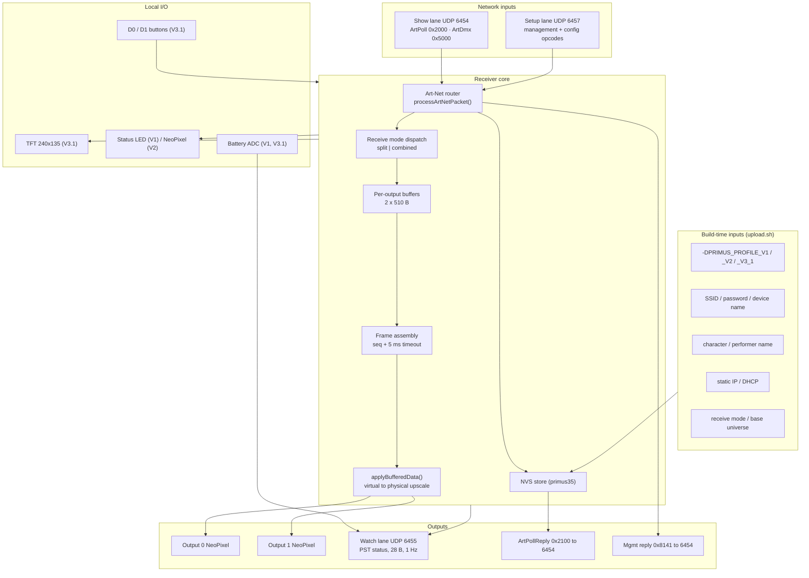

# Primus / Radius Receiver Firmware Reference — V5

Single-file reference for both receiver firmwares. Read directly from source, not from prior documentation.

| | |
|---|---|
| **Primus source** | `V5/Arduino/primusV3_receiver/` — `primusV3_receiver.ino`, `config.h`, `receive_mode.h`, `management_protocol.h`, `display.h`, `buttons.h`, `battery.h` |
| **Primus firmware** | `PrimusV3.6` v3.14.1 · NVS namespace `primus35` |
| **Radius source** | `V5/Arduino/radius_receiver/` — `radius_receiver.ino`, `config.h`, `audio.h`, `battery.h`, `cues.h`, `ftp.h`, `marius.h`, `build_opt.h` |
| **Radius firmware** | v4.20 · NVS namespace `artnet` |

> ⚠️ markers flag behaviour that differs from the design docs, or that surprises. They are the rows worth reading twice.

---

## 1. Block diagram (Primus)



---

## 2. Ports

| Port | Proto | Lane | Primus | Radius |
|---|---|---|---|---|
| **6454** | UDP | Show / Discovery | **listens** — ArtPoll 0x2000 *and* ArtDmx 0x5000 (`udp`) | **listens** — ArtPoll only (`udp`) |
| **6456** | UDP | Show (audio) | — | **listens** — ArtAudioCmd 0x8300 (`udpShow`) |
| **6457** | UDP | Setup | **listens** — mgmt 0x8140 + 0x6000/0x8100/0x8110/0x8130/0x8200/0x8210 (`udpSetup`) | **listens** — identity, IP cfg, show info, FTP gate, lane ports (`udpSetup`) |
| **6455** | UDP | Watch | **sends only** — 28-byte `PST` unicast, 1 Hz | **sends only** — `PTR` / `PFP` unicast |
| **53001** | UDP | OSC | — | ⚠️ **listens** — bound on WiFi-connect (`radius_receiver.ino:414`) |
| **21** | TCP | Content | — | **listens on demand** — FTP server, started by the Setup-lane gate |

- `PORT_SHOW_DEFAULT` resolves to **6454 in Primus** and **6456 in Radius** — same constant name, different meaning.
- Primus has **no separate Discovery lane**: ArtPoll and ArtDmx share 6454. Radius splits them because it must never accept ArtDmx.
- `PORT_DUAL_LISTEN = 1` in both trees, so lane separation is advisory today — Primus still accepts Setup opcodes on Show; Radius accepts them on any lane.
- Lane ports are runtime-configurable (Primus mgmt op `0x17`, Radius opcode `0x8220`), persisted to NVS, validated ≥1024 and all-distinct.
- ⚠️ `docs/systems/PORT_ORGANIZATION.md` describes OSC as "app-local, not a receiver listen port". The Radius firmware binds it. Doc and firmware disagree.

---

## 3. Primus — inbound commands

| Command | Opcode | Lane | Min len | Effect | Prod-locked |
|---|---|---|---|---|---|
| ArtPoll | `0x2000` | Show | 10 | ArtPollReply with capability tag | no |
| ArtDmx | `0x5000` | Show | 18 | Pixel data; ignored while test mode active | no |
| ArtAddress | `0x6000` | Setup | 107 | Rename short name (17 ch, UTF-8 validated) | **yes** |
| ArtOutputConfig | `0x8100` | Setup | 13 | Set output type per port by table index | **yes** |
| ArtReceiveConfig | `0x8110` | Setup | 15 | Set receive mode + base universe | **yes** |
| ArtVirtualResolution | `0x8130` | Setup | 13 | Set virtual pixel count per output | **yes** |
| Management request | `0x8140` | Setup | 20 | Versioned wrapper — see §4 | per-op |
| ArtIPConfig | `0x8200` | Setup | 25 | Static IP / DHCP, then `ESP.restart()` | **yes** |
| ArtShowInfo | `0x8210` | Setup | 143 | Read (mode 0) / write (mode 1) character + performer | write only |

⚠️ **"Hello" / identify is not a firmware command.** The sender sets `_hello_until` for 1 s and overrides the pixels it is already streaming (`state.py:3870`). There is no opcode, and it therefore only works on a device the sender is actively driving.

`0x8220` (lane ports) is **Radius-only**; Primus uses management op `0x17`.

---

## 4. Primus — management operations (inside `0x8140`)

20-byte header: magic(8) · opcode(2) · protoVer BE(2) · mgmtVer(1) · op(1) · requestId BE(2) · payloadLen BE(2) · status(1) · error(1).

| Op | Name | Payload | Effect | Prod-locked |
|---|---|---|---|---|
| `0x01` | GET_CONFIG | 0 | v2 blob: mode, unlock window, receive cfg, telemetry target, IP cfg, **lane ports at 27–32**, output descriptors from 33, then length-prefixed device/character/performer names | no |
| `0x10` | SET_OUTPUT_DESCRIPTORS | 24 (2×12) | Full geometry, both outputs, all-or-nothing | **yes** |
| `0x11` | SET_TELEMETRY_TARGET | 4 | `0.0.0.0` clears; rejects multicast/broadcast | **yes** |
| `0x12` | SET_OPERATING_MODE | 1 | 0 prototype / 1 production | **yes** |
| `0x13` | SET_RECEIVE_CONFIG | 3 | mode(1) + base BE(2) | **yes** |
| `0x14` | SET_IP_CONFIG | 13 | mode + ip/gw/subnet; restart in 250 ms | **yes** |
| `0x15` | SET_IDENTITY | var | 3 length-prefixed UTF-8 fields, one atomic write | **yes** |
| `0x16` | BOOT_WINDOW_UNLOCK | 0 | Escape production lock within 60 s of boot (headless boards only) | no |
| `0x17` | SET_LANE_PORTS | 6 | show/setup/watch BE; rebinds sockets in place | **yes** |

**Errors:** `1` malformed · `2` unsupported version · `3` unsupported op · `4` invalid payload · `5` locked · `6` out of range · `7` not available · `8` internal.

**Idempotency:** 4-entry reply cache, 30 s TTL, keyed on remote IP + requestId + op + full payload. Duplicates replay the cached reply instead of re-executing.

---

## 5. Radius — inbound commands

### Art-Net opcodes

| Command | Opcode | Lane | Effect |
|---|---|---|---|
| ArtPoll | `0x2000` | Discovery | ArtPollReply |
| ArtAudioCmd | `0x8300` | Show | Transport; sub-command in byte 12 |
| ArtFtpCmd | `0x8301` | Setup | `1` = stop audio and start FTP; anything else = stop FTP |
| ArtAddress | `0x6000` | Setup | Rename device |
| ArtIPConfig | `0x8200` | Setup | Static IP / DHCP |
| ArtShowInfo | `0x8210` | Setup | Read / write character + performer |
| ArtLanePorts | `0x8220` | Setup | Move Show / Setup / Watch ports |

### ArtAudioCmd sub-commands (byte 12)

| Code | Effect |
|---|---|
| `1` | Play file |
| `2` | Loop file |
| `3` | Pause |
| `4` | Set volume |
| `5` | Set volume + test tone — this is Radius "Hello" |
| `6` | ⚠️ Play cue by number — the cue number is read from the **volume** byte (`cueLookup(volume, &cue)`), and playback then uses the stored `_audioVolume`, not the byte just sent |
| `7` | ⚠️ Loop cue by number — same volume-byte reuse |
| *anything else* | ⚠️ **STOP.** The `switch` default is `audioStop()`, so a malformed or future-versioned packet silences the costume rather than being ignored |

**Filename limit is 64 characters (firmware 4.18+).** Firmware 4.17 and
earlier truncated the ArtAudioCmd filename at 32 characters on receive — and
the sender did the same on send — so any track whose name exceeded 32 chars
failed with "file not found" while short names worked (found on hardware
2026-08-12 with real show files like `Radius_Overature_soundscapetocrackle.wav`).
All filename buffers (ArtAudioCmd parse, audio player, `/cues.json` entries,
Marius actions, sender packet builder) now agree on 64, matching the PTR
telemetry clamp and the show-info field length.

**Volume byte (13) maps linearly onto the VS1053's full 127 dB attenuation
range**: `attenuation = (100 − volume) × 254 / 100` half-dB steps. That makes
the bottom half of the scale effectively silent — verified on hardware
(2026-08-12): volume 80 ≈ −25 dB (clearly audible), 60 ≈ −51 dB (quiet),
50 ≈ −64 dB (barely audible), 30 ≈ −89 dB (silence). **Usable range is
~50–100.** This mapping is inherited from V4 and deliberately kept so existing
cue volume tuning is preserved; the sender UIs clamp volume inputs to 50–100.

**Pause semantics (firmware 4.17+):** `pausePlaying(true)` clears the
library's `playingMusic` flag, so 4.16 and earlier treated a paused track as
ended (a paused loop restarted itself; a paused one-shot was cleaned up).
4.17 tracks pause explicitly: PTR reports state `2` with the track name held,
`audioIsPlaying()` (FTP guard, PRS playing flag, heartbeat) stays true, and
there is no resume command — resume by re-sending Play.

**Volume cache invalidation (firmware 4.19):** `_applyVolume()` skips the
SPI write when the requested volume hasn't changed — but track-end hiss-kill,
pause, and the test tone's internal `reset()` all mute the codec *behind*
that cache. On 4.16–4.18 the next play at an unchanged volume matched the
cache, skipped the hardware write, and decoded into silence while PTR
honestly reported `playing` — the "hello, then one track works, then
nothing" pattern. All three mute paths now invalidate the cache
(`_lastAppliedVolume = 255`); the test-tone path only invalidates, since an
SCI write right after `sineTest()` can be dropped while DREQ is low.

**Decoder soft-reset on track switch (firmware 4.20):** aborting a WAV
mid-stream with the library's `stopPlaying()` leaves the VS1053 holding
stale stream state, and the next track decodes at the wrong sample rate —
audibly slow. Explicit stops and mid-play switches now run
`_cancelPlayback()`: `stopPlaying()` → 5 ms → `softReset()` → mute + cache
invalidate. Costs ~100 ms, only on an explicit switch or stop — never in the
streaming path; natural track end consumes the stream fully and needs none
of it.

### OSC (UDP 53001)

| Address | Effect |
|---|---|
| `/stop` | Stop audio |
| `/hello` | Test tone. Aliases `/radius/hello`, `/primus/hello` |
| `/cue/<n>` | Play cue *n* (1–255) |

**Radius has no management protocol.** No `0x8140`, no GET_CONFIG, no operating mode, no telemetry target, no production lock. Its entire config surface is the five bare Setup opcodes above.

Any ArtAudioCmd arriving while FTP is running stops the FTP server first; conversely `ArtFtpCmd 1` stops audio before starting FTP. The two are mutually exclusive by design.

---

## 6. Outbound packets

| Product | Packet | Opcode / magic | Destination | Size | When |
|---|---|---|---|---|---|
| Primus | ArtPollReply | `0x2100` | requester **:6454 literal** | 239 B | On ArtPoll; broadcast after any config change |
| Primus | Management reply | `0x8141` | requester **:6454 literal** | ≤256 B | Every `0x8140` request, ACK or NACK |
| Primus | ShowInfo response | `0x8210` | requester **:6454 literal** | 143 B | On read, or after successful write |
| Primus | Unified status | `PST` | telemetry target : `portWatch` | 28 B | ~1 Hz + 0–250 ms jitter |
| Radius | ArtPollReply | `0x2100` | requester : `portDiscovery` | 239 B | On ArtPoll |
| Radius | Audio status | `0x8302` | sender : `portWatch` | 46 B | After every ArtAudioCmd and OSC cue |
| Radius | Track telemetry | `PTR` | sender : `portWatch` | 5–69 B | Play/stop/pause edges + 1 Hz heartbeat while playing |
| Radius | Packet rate | `PFP` | sender : `portWatch` | 7 B | 1 Hz |
| Radius | Unified status | `PRS` | sender : `portWatch` | 17 B | 1 Hz + MAC jitter, anti-phase to `PTR`/`PFP` (firmware 4.16+) |

⚠️ **Primus pins all three reply paths to literal `PORT_SHOW_DEFAULT` (6454)** — `sendArtPollReply`, `sendShowInfoReply`, `sendManagementReplyPacket` — rather than the runtime `portShow`. Move Primus's Show lane via mgmt `0x17` and it listens on the new port but keeps answering on the old one. Radius discovery replies follow `portDiscovery` and do not have this problem.

⚠️ **Primus sends no telemetry at all until mgmt op `0x11` sets a target.** There is no broadcast fallback.

⚠️ The 28-byte `PST` packet **replaces the 7-byte `PFP` packet** used in V3.6 and V4. `CLAUDE.md` still documents `PFP`.

---

## 7. Output types

Sender `OUTPUT_TYPES` indices must match these exactly.

| ID | Name | Pixels | Layout | Grid | Default virtual px | Workshop label |
|---|---|---|---|---|---|---|
| 0 | Off | 0 | none | — | 0 | None |
| 1 | Short Strip | 30 | linear | — | 30 | Collar |
| 2 | Long Strip | 72 | linear | — | 72 | — |
| 3 | Grid 8x8 | 64 | grid | 8×8 | 64 | — |
| 4 | Grid 8x4 | 32 | grid | 8×4 | **1** | Badge |
| 5 | Extra Long Strip | 122 | linear | — | 122 | Belt |
| 255 | Custom | descriptor | — | — | descriptor | — |

**Wire descriptor (12 B):** `enabled · layout · pixelCount BE · gridRows · gridCols · traversalAxis · scanPattern · startCorner · reserved · virtualPixelCount BE`

Axis row/column-major · scan progressive/serpentine · start corner TL/TR/BL/BR. Grids default to serpentine. `OUTPUT_CUSTOM` (255) is inferred when a descriptor matches no table row.

**Limits:** `MAX_LEDS_PER_PORT` 170 · `MAX_BUFFER_SIZE` 510 B · `NUM_OUTPUTS` 2 · RGB 3 B/px · hardware brightness locked at 255 (all dimming is sender-side RGB scaling).

Grid 8x4 defaulting to **1** virtual pixel is deliberate: a Badge ships 3 bytes on the wire and the node upscales to all 32 LEDs.

---

## 8. Primus board profiles

| | **V1 Huzzah32** | **V2 Feather** | **V3.1 Reverse TFT** (default) |
|---|---|---|---|
| Build flag | `-DPRIMUS_PROFILE_V1` | `-DPRIMUS_PROFILE_V2` | `-DPRIMUS_PROFILE_V3_1` |
| Caps code `B:` | `v1` | `v2` | `v31` |
| Output 0 pin | GPIO32 | GPIO32 | ⚠️ A0 / GPIO17 |
| Output 1 pin | GPIO12 | GPIO12 | ⚠️ A1 / GPIO18 |
| Output 0 default | Grid 8x4 (Badge) | Grid 8x4 | Grid 8x4 |
| Output 1 default | Long Strip 72 | Long Strip 72 | Long Strip 72 |
| LED driver | direct NeoPixel | direct NeoPixel | direct NeoPixel |
| Link indicator | `LED_BUILTIN` (13) | onboard NeoPixel pin 0, pwr pin 2, brt 40 | TFT |
| TFT | — | — | 240×135 ST7789, 3 info screens |
| Buttons | — | — | D0 `INPUT_PULLUP` active-LOW · D1 `INPUT_PULLDOWN` active-HIGH |
| Battery sense | A13, LiPo 3.2–4.2 V | none | A4 / GPIO14, 5 V rail, 100k/100k ÷2 |
| Outputs WiFi-gated | no | no | **yes** |
| Feature flags `F:` | `RIOHBMSGL` | `RIOHMSGL` | `RIOHBMSGL` |

**Flags:** **R**ename · **I**P config · **O**utput config · **H**ello/identify · **B**attery · **M**ode config · **S**how info · **G** management protocol (informational only in `F:` — the sender gates management on the separate `\|G:` token, not this letter) · **L**ane-aware (firmware binds a separate Setup lane; added 3.14.1).

⚠️ `CLAUDE.md` still describes V3.1 as NeoPXL8 on GPIO14/15. That is the legacy FeatherWing path — still compiled behind `PRIMUS_DRIVER_NEOPXL8`, but no current profile selects it. `config.h:113` is authoritative.

**V3.1 buttons:** D0 cycles info screens. D1 short = test mode / edit commit; D1 long (≥600 ms) = cycle edit focus (Out0 → Out1 → Receive). In production mode D1-long unlocks to prototype and D1-short toggles TFT power.

**Test animations (5):** Off, Color Wipe, White, Rainbow, March.

---

## 9. Receive modes

| Mode | Value | Universes | Layout | Base max |
|---|---|---|---|---|
| `SPLIT` | 0 | one per active output, `base + index` | each output reads its own universe from offset 0 | 32766 |
| `COMBINED` | 1 (default) | one, at `base` | outputs packed contiguously by `virtualPixelCount × 3` | 32767 |

- Combined is rejected when total active virtual pixels > 170 (`RECEIVE_MODE_COMBINED_MAX_PIXELS`).
- If an output type change makes combined invalid, the firmware **auto-falls back to SPLIT** and persists it.
- Frame assembly tracks the ArtDmx sequence byte. Ready when `expectedUniverseCount` universes arrive, or after `FRAME_ASSEMBLY_TIMEOUT` (5 ms) — in which case a partial frame is shown.

### Pixel data path

```
ArtDmx (Show 6454)
  → seq = data[12], universe = data[14..15] LE, len = data[16..17] BE
  → handleArtDmxForReceiveMode()   → split or combined slice
  → outputBuffers[o][virtualPixelCount * 3]        (zero-padded if short)
  → frame ready (all universes, or 5 ms timeout)
  → applyBufferedData(): physical pixel p reads virtual index (p * virtual) / physical
  → showOutputs()   → adaptive: showInterval = showDuration_us / 1000 + 1 ms
```

Virtual resolution is the transport compression: a 32-px Badge sent as 1 virtual pixel is 3 bytes on the wire, upscaled to all 32 LEDs on the node.

---

## 10. Persistence — Primus NVS namespace `primus35`

| Key | Type | Holds | Compatibility mirrors |
|---|---|---|---|
| `outDescAll` | 28 B + CRC16 | output descriptors, both outputs | `otype0/1`, `vpx0/1` |
| `recvCfg` | 54 B + CRC16 | mode, base universe, override build id | `recvMode`, `univBase` |
| `netCfg` | 64 B + CRC16 | static/DHCP + ip/gateway/subnet | `staticIP`, `gateway`, `subnet` |
| `identity` | 199 B + CRC16 | device / character / performer names | `shortName`, `characterName`, `performerName` |
| `opMode` | u8 | prototype (0) / production (1) | — |
| `teleTarget` | 4 B | telemetry unicast target IP | — |
| `portShow` · `portSetup` · `portWatch` | u16 each | lane ports | — |

**Write ordering rules that matter:**

1. The CRC'd blob is authoritative and written **first**; mirrors follow only after the commit succeeds. An interrupted write can never produce a hybrid state.
2. A **present but corrupt** blob is reset to defaults — never rebuilt from the mirrors.
3. Mirrors are read only when the blob key is absent entirely (upgrade from older firmware), then migrated forward and the legacy keys removed.

Build-time overrides are gated by `PRIMUSV3_OVERRIDE_BUILD_ID`: a flashed override applies **once** per build id, after which runtime user changes stick across reboots.

Radius uses a separate namespace, `artnet`.

---

## 11. Unified status packet — `PST`, 28 B, to Watch 6455

| Offset | Field | Encoding | Notes |
|---|---|---|---|
| 0–2 | magic `'P','S','T'` | ASCII | |
| 3 | protocol version | u8 = 1 | `STATUS_PROTOCOL_VERSION` |
| 4–5 | sequence | u16 BE | wraps; sender uses it for reboot detection |
| 6–9 | uptime seconds | u32 BE | `millis() / 1000` |
| 10–11 | flags | u16 BE | see below |
| 12–13 | rendered FPS ×10 | u16 BE | actual LED show rate |
| 14–15 | packet rate ×10 | u16 BE | inbound ArtDmx packets/s |
| 16 | RSSI | int8 | dBm |
| 17–19 | firmware version | u8 ×3 | major, minor, patch |
| 20 | operating mode | u8 | 0 prototype, 1 production |
| 21 | battery power mode | u8 | 0 battery · 1 charging · 2 plugged · 3 switch-off · 4 fault · 5 unavailable |
| 22–23 | battery millivolts | u16 BE | |
| 24 | battery percent | u8 | 255 = not available |
| 25 | unlock seconds left | u8 | clamped to 255 |
| 26–27 | reserved | zero | |

**Flags:** `0x01` wifi · `0x02` static IP · `0x04` output power · `0x08` test active · `0x10` telemetry configured · `0x20` production · `0x40` unlock window open · `0x80` battery valid.

Sent only when a telemetry target has been configured **and** WiFi is up. The sender identifies the device by **source IP only** — `artnet.py:774` passes `addr[0]` and discards the source port.

---

## 11b. Radius telemetry packets — `PTR` / `PFP` / `PRS`, to Watch 6455

All three are unicast from `udpFps` to the latched `senderIP` at `portWatch`, sent only when a sender is known and WiFi is up. `senderIP` latches from the first Art-Net packet seen and re-latches whenever an ArtAudioCmd (`0x8300`) or ArtFtpCmd (`0x8301`) arrives from a different address; ArtPoll never re-latches (WiFiUDP cannot distinguish a unicast poll from a broadcast sweep, and a passive discovery tool must not steal the telemetry stream).

### `PTR` — track telemetry (**frozen — do not change**)

Sent on every play/stop/pause/loop transition, plus a 1 Hz heartbeat while playing, plus a stop-edge packet when playback ends on its own. Parsed by `RadiusTelemetryListener` and feeds `has_live_playback()`, so this layout is byte-for-byte frozen.

| Offset | Field | Encoding |
|---|---|---|
| 0–2 | magic `'P','T','R'` | ASCII |
| 3 | playback state | u8 — 0 stopped · 1 playing · 2 paused |
| 4 | filename length | u8, ≤ 64 |
| 5… | filename | bytes, **no NUL terminator**; total packet = 5 + length |

### `PFP` — packet rate (**frozen — do not change**)

1 Hz. Same 7-byte shape as the legacy Primus packet; the FPS field is always 0 on Radius.

| Offset | Field | Encoding |
|---|---|---|
| 0–2 | magic `'P','F','P'` | ASCII |
| 3–4 | FPS | u16 BE — **always 0 on Radius** |
| 5–6 | packet rate | u16 BE, packets/s |

### `PRS` — unified status, 17 B (firmware 4.16+)

1 Hz with MAC-derived boot jitter (`((mac[4]<<8)|mac[5]) % 251` ms) plus a +500 ms phase offset so it lands anti-phase to the `PTR`/`PFP` tick, with a catch-up clamp after stalls (sineTest, WiFi reconnect) so missed packets are never bursted. Deliberately a new magic: `PST` is owned by Primus (reboot heuristics), `PBT` had no flags word.

| Offset | Field | Encoding | Notes |
|---|---|---|---|
| 0–2 | magic `'P','R','S'` | ASCII | |
| 3 | protocol version | u8 = 1 | |
| 4–5 | sequence | u16 BE | wraps; reboot detection |
| 6–9 | uptime seconds | u32 BE | `millis() / 1000` |
| 10–11 | flags | u16 BE | see below |
| 12 | RSSI | int8 | dBm |
| 13 | battery power mode | u8 | 0 battery · 1 charging · 2 plugged · 3 switch-off · 4 fault · 5 unavailable |
| 14–15 | battery millivolts | u16 BE | |
| 16 | battery percent | u8 | 255 = not available |

**Flags:** `0x0001` wifi connected · `0x0002` static IP · `0x0008` test tone active (fired within the last 2 s — sineTest blocks, so the tick can never observe it live) · `0x0080` battery valid · `0x0100` SD ready · `0x0200` FTP running · `0x0400` audio playing · `0x0800` looping · `0x1000` marius configured · `0x2000` marius connected.

**Battery sampling** (V1 HUZZAH32 only, `battery.h`): exactly one `analogReadMilliVolts(A13) * 2` per second (stock VBAT/2 divider on GPIO35/ADC1) smoothed with a 4:1 EMA. Never multi-sample or `delay()` here — the Primus 8-sample pattern blocks ~16 ms and the VS1053 FIFO drains in ~11.6 ms. LiPo percent curve, validity window (3200–4200 mV) and the 2-strike switch-off detection match Primus `battery.h`. On V2 (S3 Reverse TFT) the battery fields report mode 5 / 0 mV / 255.

---

## 12. Capability tag — ArtPollReply Node Report, 64-byte hard limit

```
#0001 [0042] OK|PV3CAP1|F:RIOHBMSGL|B:v31|IP:D|U:C:0|0:4:0:1|1:2:0:72|G:1P
```

| Order | Token | Meaning | Why in this position |
|---|---|---|---|
| 1 | `#nnnn [pkts] OK\|PV3CAP1` | counter + versioned prefix | identifies the tag |
| 2 | `F:` | feature flags | **first** — losing it degrades the device to "unconfirmed legacy hardware" with rename, hello, IP, output, receive-mode, battery and show-info all disabled |
| 3 | `B:` | board profile code | drives the hardware label in the UI |
| 4 | `IP:` | `S` static / `D` DHCP | |
| 5 | `U:` | `C`ombined / `S`plit + base universe | |
| 6 | `SHOW:` `MGMT:` `TELE:` | lane ports — **only emitted for a lane moved off its default** (firmware 3.14.1+) | a node whose Setup lane moved but cannot say so is unmanageable; `L` in `F:` + no lane token means "on the documented defaults", no `L` means pre-lane firmware with Setup on Show |
| 7 | `port:type:universe:virtual` | per-output tuples | only appended when the whole token fits — a truncated tuple looks valid but mis-reports the output type; the sender keeps last-known values when they vanish |
| 8 | `G:` | management protocol version + `L`ocked / `P`rototype | ⚠️ ranked last on the theory that nothing parses it — **wrong**: the sender's `MANAGEMENT_TOKEN_RE` gates `management_supported` on it, so a report loaded heavily enough to drop `G:` silently disables all `0x8140` management for that device. Known issue (see CHANGES.md). |

Firmware **3.12+** moved `F:` to immediately after the prefix (earlier
firmware put it last, where it was silently truncated away). Firmware
**3.14.1** removed the unconditional `SHOW:/MGMT:/TELE:` triple — those 30
bytes alone overflowed the report on every device — introduced the `L` flag,
and applied the whole-token-or-nothing guard to lane tokens and `G:` as well
as the tuples. **Note:** the lane split itself shipped under an unchanged
3.14.0 version string, so two different firmwares report 3.14.0; `L` is the
reliable signal, not the version.

With 2 active outputs, a 3-digit base universe, combined mode and a static IP, the full token set exceeds 64 bytes routinely — **truncation is the normal case, not an edge case.**

### Radius Node Report (firmware 4.16+)

```
#0001 [0042] OK|PVRAD1|B:v1|F:RIHASB|IP:D|V:4.20|MC:1|MP:PuckName
```

| Order | Token | Meaning |
|---|---|---|
| 1 | `#nnnn [pkts] OK\|PVRAD1` | counter + versioned Radius prefix |
| 2 | `B:` | board profile (`v1` HUZZAH32, `v2` S3 Reverse TFT) |
| 3 | `F:` | feature flags — `R` rename · `I` IP config · `H` hello/test-tone · `A` audio (implies FTP) · `S` show info · `B` battery telemetry (`PRS`) |
| 4 | `IP:` | `S` static / `D` DHCP |
| 5 | `AUD:` `MGMT:` `TELE:` | lane ports — **only emitted for a lane moved off its default** (6456 / 6457 / 6455); absence means "on the documented defaults". The always-on `\|FTP:21` token of 4.1 is gone (FTP port is not configurable) |
| 6 | `V:` | firmware version string |
| 7 | `MC:` / `MP:` | Marius configured/connected + puck name — last, because the puck name is the one unbounded field |

Every token uses the same whole-token-or-nothing append guard as Primus: a token that does not fit entirely inside the 64-byte field is dropped, never truncated — a truncated `\|MGMT:645` would parse as a plausible port and black-hole all Setup traffic.

---

## 13. Operating modes and gates

| Gate | Effect |
|---|---|
| **Production mode** (`opMode=1`) | Rejects rename, output config, receive config, virtual res, IP config, show-info write, and all mgmt ops except `GET_CONFIG` and `BOOT_WINDOW_UNLOCK` (NACK `MGMT_ERROR_LOCKED`). Silences serial diagnostics, disables test mode, blanks the TFT. |
| **Boot unlock window** | Headless boards only (`!BOARD_HAS_BUTTONS`): 60 s after boot, mgmt `0x16` drops back to prototype. Latched closed once expired — never reopens, including across `millis()` wrap. Button boards use the D1 long-press instead. |
| **WiFi output gating** | V3.1 only: LED driver stays uninitialised and outputs dark until WiFi connects; outputs blanked and latched dark on WiFi loss. |

---

## 14. Timing constants

| Constant | Value | Purpose |
|---|---|---|
| `FPS_INTERVAL` | 1000 ms | FPS / packet-rate window + serial diagnostics line |
| `BATTERY_REPORT_INTERVAL_MS` | 5000 ms | ADC sample: 8 reads, min/max discarded, 4:1 EMA |
| `CONNECTION_TIMEOUT` | 10000 ms | mark an output idle after no packets |
| `RECONNECT_INTERVAL` | 5000 ms | WiFi retry cadence |
| `FRAME_ASSEMBLY_TIMEOUT` | 5 ms | give up waiting and show a partial frame |
| status cadence | 1000 ms | + 0–250 ms MAC-derived jitter so a fleet doesn't sync-burst |
| restart delay | 250 ms | after IP config change, so the ACK reaches the sender first |
| `PRODUCTION_UNLOCK_WINDOW_MS` | 60000 ms | boot unlock window, headless boards only |
| `MANAGEMENT_REPLY_CACHE_TTL_MS` | 30000 ms | idempotency cache lifetime, 4 entries |
| `BTN_LONG_PRESS_MS` | 600 ms | D1 long-press threshold |
| `showInterval` | adaptive | recomputed each frame as `showDuration_us / 1000 + 1` ms |

---

## 15. Build-time parameters — `V5/Arduino/upload.sh`

| Flag | Compiles to | Applies |
|---|---|---|
| `-v1` / `-v2` / `-v3` | `-DPRIMUS_PROFILE_V1` / `_V2` / `_V3_1` | every build |
| `-ssid <name>` | `DEFAULT_WIFI_SSID` | every boot — `PRIMUSV3_FORCE_WIFI_CREDENTIAL_OVERRIDE` clears stored station credentials once |
| `-pw <password>` | `DEFAULT_WIFI_PASSWORD` | every boot |
| `--name <name>` | `DEVICE_SHORT_NAME` + force flag | once per override build id |
| `--character-name <name>` | `DEFAULT_SHOW_CHARACTER_NAME` | once per override build id (max 64 ch) |
| `--performer-name <name>` | `DEFAULT_SHOW_PERFORMER_NAME` | once per override build id (max 64 ch) |
| `--static-ip <ip>` | `PRIMUSV3_STATIC_IP_OCTETS` | once per override build id |
| `--gateway <ip>` | `PRIMUSV3_STATIC_GATEWAY_OCTETS` | paired with `--static-ip` |
| `--subnet <ip>` | `PRIMUSV3_STATIC_SUBNET_OCTETS` | paired with `--static-ip` |
| `--dhcp` | `PRIMUSV3_FORCE_DHCP_OVERRIDE` | once per override build id |
| `--receivemode split\|combined` | `PRIMUS_DEFAULT_RECEIVE_MODE` | once per override build id |
| `--universe <n>` | `PRIMUS_DEFAULT_UNIVERSE_BASE` | once per override build id (0–32767) |
| `--ports` / `--ports-json` | — | list likely ESP32 serial ports and exit |
| `--auto` | — | select the only detected ESP32-like port |
| `--all` | — | flash every detected ESP32-like port with the same profile |
| `--compile` | — | compile only, like Arduino IDE Verify |
| `--install` | — | check / install required Arduino libraries and exit |
| `--baud <rate>` | — | override upload speed |

"Once per override build id" means the value is written to NVS on first boot of that build, after which runtime changes by the user persist and are not re-overwritten on reboot.

---

## Appendix — deltas from `CLAUDE.md`

Worth reconciling when that file is next updated:

1. **Telemetry format.** V5 sends the 28-byte `PST` unified status packet, not the 7-byte `PFP` packet. Unicast to a configured target only; no broadcast fallback.
2. **V3.1 output pins.** A0/GPIO17 and A1/GPIO18, direct NeoPixel — not NeoPXL8 on GPIO14/15.
3. **Capability tag.** Lane-port tokens (`SHOW:`/`MGMT:`/`TELE:`) are emitted **only for lanes moved off their defaults** (3.14.1+); `L` in `F:` marks lane-aware firmware. A node on defaults shows no lane token.
4. **Reply port.** Primus replies are pinned to literal 6454 and do not follow a reconfigured `portShow`.
5. **OSC on Radius.** Firmware binds UDP 53001; `PORT_ORGANIZATION.md` says it is app-local only.
