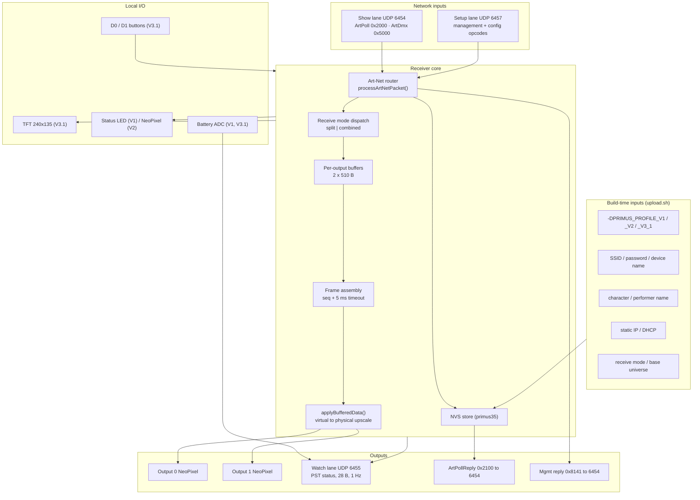

# Primus Receiver Firmware Map (V5)

Source: `V5/Arduino/primusV3_receiver/` — `primusV3_receiver.ino` (~2600 L), `config.h`, `receive_mode.h`, `management_protocol.h`, `display.h`, `buttons.h`, `battery.h`.
Firmware `PrimusV3.6` **3.14.1**, NVS namespace `primus35`.

---

## 1. Block diagram



---

## 2. UDP lanes and ports

| Lane | Default | Constant | Direction | Carries |
|---|---|---|---|---|
| **Show** | `6454` | `PORT_SHOW_DEFAULT` | in (`udp`) | `ArtPoll` 0x2000, `ArtDmx` 0x5000 |
| **Setup** | `6457` | `PORT_SETUP_DEFAULT` | in (`udpSetup`) | management 0x8140 + all config opcodes |
| **Watch** | `6455` | `PORT_WATCH_DEFAULT` | out (`udpStatus`, ephemeral src) | `PST` unified status, unicast to telemetry target |

Behavioral rules:

- `PORT_DUAL_LISTEN 1` — Setup opcodes are **also accepted on the Show lane** during migration. Set to `0` to enforce lane separation.
- `ArtPoll` / `ArtDmx` arriving on the Setup socket are **dropped** (`fromSetupSocket` guard).
- **All replies go to hard-coded `PORT_SHOW_DEFAULT` (6454)**, not to the lane the request came in on, and not to the configured `portShow` — controllers (EOS etc.) only listen there. Applies to `sendArtPollReply`, `sendManagementReplyPacket`, `sendShowInfoReply`.
- Ports are runtime-settable via management op `0x17` and persisted (`portShow`/`portSetup`/`portWatch`). Validation: each ≥ 1024, all three distinct. Invalid stored set falls back to defaults.
- Changing Show or Setup restarts those sockets in place; changing Watch takes effect on the next status send. Static UDP buffer `MAX_UDP_PACKET = 600` B — larger packets are drained and discarded.

---

## 3. Art-Net opcodes

### Inbound

| Opcode | Name | Lane | Prod-locked | Min len | Effect |
|---|---|---|---|---|---|
| `0x2000` | ArtPoll | Show only | no | 10 | Unicast ArtPollReply to sender |
| `0x5000` | ArtDmx | Show only | no | 18 | Pixel data; ignored while test mode active |
| `0x6000` | ArtAddress | Setup (+Show) | **yes** | 107 | Rename device (short name, 17 ch, UTF-8 validated) |
| `0x8100` | ArtOutputConfig | Setup (+Show) | **yes** | 13 | Set output type per port by table index |
| `0x8110` | ArtReceiveConfig | Setup (+Show) | **yes** | 15 | Set receive mode + base universe |
| `0x8130` | ArtVirtualResolution | Setup (+Show) | **yes** | 13 | Set virtual pixel count per output |
| `0x8140` | Management request | Setup (+Show) | per-op | 20 | Versioned protocol — see §4 |
| `0x8200` | ArtIPConfig | Setup (+Show) | **yes** | 25 | Static IP / DHCP, then `ESP.restart()` |
| `0x8210` | ArtShowInfo | Setup (+Show) | write only | 143 | Read (mode 0) / write (mode 1) character + performer |

`0x8220` (lane ports) is **Radius-only**; Primus uses management op `0x17` instead.

### Outbound

| Opcode / magic | To | When |
|---|---|---|
| `0x2100` ArtPollReply | dest:6454, 239 B | on ArtPoll, and broadcast after any config change |
| `0x8141` Management reply | requester:6454, ≤256 B | every 0x8140 request (ACK or NACK) |
| `0x8210` ShowInfo response | requester:6454, 143 B | on read or successful write |
| `PST` unified status | telemetry target:6455, 28 B | ~1 Hz, MAC-derived jitter 0–250 ms |

---

## 4. Management protocol (0x8140 / 0x8141)

20-byte header: magic(8) · opcode(2) · protoVer BE(2) · mgmtVer(1) · op(1) · requestId BE(2) · payloadLen BE(2) · status(1) · error(1).

| Op | Name | Payload | Notes |
|---|---|---|---|
| `0x01` | GET_CONFIG | 0 | Returns v2 blob: mode, unlock window, receive cfg, telemetry target, IP cfg, **lane ports at 27–32**, output descriptors from 33, then length-prefixed device/character/performer names |
| `0x10` | SET_OUTPUT_DESCRIPTORS | 24 (2 × 12) | Full geometry, all-or-nothing |
| `0x11` | SET_TELEMETRY_TARGET | 4 | `0.0.0.0` clears; rejects multicast/broadcast |
| `0x12` | SET_OPERATING_MODE | 1 | 0 prototype / 1 production |
| `0x13` | SET_RECEIVE_CONFIG | 3 | mode(1) + base BE(2) |
| `0x14` | SET_IP_CONFIG | 13 | mode + ip/gw/subnet; schedules restart in 250 ms |
| `0x15` | SET_IDENTITY | var | 3 length-prefixed UTF-8 fields |
| `0x16` | BOOT_WINDOW_UNLOCK | 0 | Escape production lock within 60 s of boot (headless boards only) |
| `0x17` | SET_LANE_PORTS | 6 | show/setup/watch BE; rebinds sockets |

Errors: `1` malformed · `2` bad version · `3` unsupported op · `4` invalid payload · `5` locked · `6` out of range · `7` not available · `8` internal.
**Idempotency:** 4-entry reply cache, 30 s TTL, keyed on remote IP + requestId + op + full payload. Duplicate requests replay the cached reply instead of re-executing.

---

## 5. Hardware I/O by board profile

| | **V1 Huzzah32** | **V2 Feather** | **V3.1 Reverse TFT** (default) |
|---|---|---|---|
| Build flag | `PRIMUS_PROFILE_V1` | `PRIMUS_PROFILE_V2` | `PRIMUS_PROFILE_V3_1` |
| Caps code `B:` | `v1` | `v2` | `v31` |
| Output 0 pin | GPIO32 | GPIO32 | A0 / GPIO17 |
| Output 1 pin | GPIO12 | GPIO12 | A1 / GPIO18 |
| Default out 0 | Grid 8×4 (Badge) | Grid 8×4 | Grid 8×4 |
| Default out 1 | Long Strip 72 | Long Strip 72 | Long Strip 72 |
| Driver | direct NeoPixel | direct NeoPixel | direct NeoPixel |
| Link indicator | `LED_BUILTIN` (13) | onboard NeoPixel pin 0, pwr pin 2, brt 40 | TFT |
| TFT / buttons | — | — | 240×135 ST7789 + D0/D1 |
| Battery sense | A13, LiPo 3.2–4.2 V | none | A4 / GPIO14, 5 V rail, ÷2 divider |
| Outputs WiFi-gated | no | no | **yes** (buck/boost spin-up) |
| Feature flags `F:` | `RIOHBMSGL` | `RIOHMSGL` | `RIOHBMSGL` |

Flags: **R**ename · **I**P config · **O**utput config · **H**ello/identify · **B**attery · **M**ode config · **S**how info · **G** management protocol (informational only here — the sender gates management on the separate `|G:` token) · **L**ane-aware (binds a separate Setup lane, 3.14.1+).

Buttons (V3.1 only): **D0** `INPUT_PULLUP`, active-LOW → cycle info screens. **D1** `INPUT_PULLDOWN`, active-HIGH → short press = test mode / edit commit, long press ≥600 ms = cycle edit focus (Out0 → Out1 → Receive). In production mode D1-long unlocks to prototype, D1-short toggles TFT power.

TFT screens: 0 dashboard · 1 info · 2 edit settings. Test animations: `Off`, `Color Wipe`, `White`, `Rainbow`, `March`.

---

## 6. Output types (must match sender `OUTPUT_TYPES`)

| ID | Name | Pixels | Layout | Grid | Default virtual px |
|---|---|---|---|---|---|
| 0 | Off | 0 | none | — | 0 |
| 1 | Short Strip | 30 | linear | — | 30 |
| 2 | Long Strip | 72 | linear | — | 72 |
| 3 | Grid 8x8 | 64 | grid | 8×8 | 64 |
| 4 | Grid 8x4 | 32 | grid | 8×4 | **1** |
| 5 | Extra Long Strip | 122 | linear | — | 122 |
| 255 | Custom | — | — | — | descriptor-defined |

Per-output runtime descriptor (12 B on the wire): `enabled · layout · pixelCount BE · gridRows · gridCols · traversalAxis · scanPattern · startCorner · reserved · virtualPixelCount BE`.
Axis row/column-major, scan progressive/serpentine, start corner TL/TR/BL/BR. `OUTPUT_CUSTOM` is inferred when a descriptor matches no table row.

Hard limits: `MAX_LEDS_PER_PORT 170`, `MAX_BUFFER_SIZE 510` B, `NUM_OUTPUTS 2`, RGB 3 B/px, hardware brightness locked at 255 (dimming is sender-side).

---

## 7. Receive modes

| Mode | Universes | Layout |
|---|---|---|
| `SPLIT` (0) | one per active output, `base + index` | each output reads its own universe from offset 0 |
| `COMBINED` (1, default) | one, `base` | outputs packed contiguously by `virtualPixelCount × 3` |

Combined is rejected if total active virtual pixels > 170. Base universe range: ≤32766 split, ≤32767 combined. If an output type change makes combined invalid, the firmware **auto-falls back to split** and persists it.

Frame assembly: tracks ArtDmx sequence byte; a frame is ready when `expectedUniverseCount` universes arrive, or after `FRAME_ASSEMBLY_TIMEOUT` 5 ms (partial frame shown).

---

## 8. Pixel data path

```
ArtDmx (Show 6454)
  → seq = data[12], universe = data[14..15] LE, len = data[16..17] BE
  → handleArtDmxForReceiveMode()  → split or combined slice
  → outputBuffers[o][virtualPixelCount * 3]        (zero-padded if short)
  → frame ready (all universes, or 5 ms timeout)
  → applyBufferedData(): physical pixel p reads virtual index (p * virtual) / physical
  → showOutputs()  → adaptive: showInterval = showDuration_us/1000 + 1 ms
```

Virtual resolution is the transport compression: a 32-px Badge sent as 1 virtual pixel is 3 bytes on the wire, upscaled to all 32 LEDs on the node.

---

## 9. Persistence (NVS `primus35`)

| Key | Type | Authoritative record | Compatibility mirrors |
|---|---|---|---|
| `outDescAll` | 28 B + CRC16 | output descriptors | `otype0/1`, `vpx0/1` |
| `recvCfg` | 54 B + CRC16 | mode, base, override build id | `recvMode`, `univBase` |
| `netCfg` | 64 B + CRC16 | static/DHCP + ip/gw/subnet | `staticIP`, `gateway`, `subnet` |
| `identity` | 199 B + CRC16 | device / character / performer | `shortName`, `characterName`, `performerName` |
| `opMode` | u8 | prototype / production | — |
| `teleTarget` | 4 B | telemetry unicast target | — |
| `portShow` / `portSetup` / `portWatch` | u16 each | lane ports | — |

Rules that matter: the CRC'd blob is authoritative and written first; mirrors follow only after commit, so an interrupted write can never produce a hybrid. A **present but corrupt** blob is reset to defaults — never rebuilt from the mirrors. Mirrors are read only when the blob key is absent entirely (upgrade from older firmware), then migrated forward.

Build-time overrides are gated by `PRIMUSV3_OVERRIDE_BUILD_ID`: a flashed override applies **once** per build id, then user changes stick across reboots.

---

## 10. Discovery capability tag (ArtPollReply Node Report)

64-byte hard limit — tokens are emitted most-important-first, and every token
from the lane ports onward appends whole-or-not-at-all (a truncated
`|MGMT:645` parses as a plausible port and would black-hole Setup traffic):

```
#0001 [pkts] OK|PV3CAP1|F:RIOHBMSGL|B:v31|IP:D|U:C:0|0:4:0:1|1:2:0:72|G:1P
```

| Token | Meaning |
|---|---|
| `F:` | feature flags — **first**, because losing it degrades the device to "unconfirmed legacy" |
| `B:` | board profile code |
| `IP:` | `S` static / `D` DHCP |
| `U:` | `C`ombined or `S`plit + base universe |
| `SHOW:`/`MGMT:`/`TELE:` | lane ports — **emitted only for a lane moved off its default** (3.14.1+); a node on defaults shows none, and `L` in `F:` is what marks it lane-aware |
| `port:type:universe:virtual` | per-output tuples — only appended when the whole token fits; the sender keeps last-known values when they vanish |
| `G:` | management protocol version + `L`ocked / `P`rototype — ⚠️ ranked last on the belief nothing parses it, but the sender's `MANAGEMENT_TOKEN_RE` gates `management_supported` on it; dropping it silently disables all `0x8140` management (known issue, see CHANGES.md) |

---

## 11. Unified status packet (`PST`, 28 B, Watch 6455)

| Off | Field | | Off | Field |
|---|---|---|---|---|
| 0–2 | `'P','S','T'` | | 16 | RSSI (int8) |
| 3 | protocol version = 1 | | 17–19 | fw major / minor / patch |
| 4–5 | sequence BE | | 20 | operating mode |
| 6–9 | uptime seconds BE | | 21 | battery power mode |
| 10–11 | flags BE | | 22–23 | battery mV BE |
| 12–13 | rendered FPS ×10 BE | | 24 | battery % (255 = n/a) |
| 14–15 | packet rate ×10 BE | | 25 | unlock seconds remaining |

Flags: `0x01` wifi · `0x02` static IP · `0x04` output power · `0x08` test active · `0x10` telemetry configured · `0x20` production · `0x40` unlock window open · `0x80` battery valid.
Battery power modes: 0 battery · 1 charging · 2 plugged · 3 switch-off · 4 fault · 5 unavailable.

**Sent only when a telemetry target has been configured** (mgmt `0x11`) and WiFi is up — there is no broadcast fallback. This replaces the older 7-byte `PFP` FPS packet.

---

## 12. Operating modes and gates

| Gate | Effect |
|---|---|
| **Production mode** (`opMode=1`) | Rejects rename, output config, receive config, virtual res, IP config, show-info write, and all mgmt ops except `GET_CONFIG` and `BOOT_WINDOW_UNLOCK` (NACK `MGMT_ERROR_LOCKED`). Silences serial diagnostics, disables test mode, blanks the TFT. |
| **Boot unlock window** | Headless boards only (`!BOARD_HAS_BUTTONS`): 60 s after boot, mgmt `0x16` can drop back to prototype. Latched closed once expired — never reopens, including across `millis()` wrap. Button boards use the D1 long-press instead. |
| **WiFi output gating** | V3.1 only: LED driver stays uninitialized and outputs dark until WiFi connects; outputs are blanked and latched dark on WiFi loss. |

---

## 13. Timing constants

| Constant | Value | Purpose |
|---|---|---|
| `FPS_INTERVAL` | 1000 ms | FPS/packet-rate window + serial line |
| `BATTERY_REPORT_INTERVAL_MS` | 5000 ms | ADC sample (8 reads, min/max discarded, 4:1 EMA) |
| `CONNECTION_TIMEOUT` | 10000 ms | Mark an output idle after no packets |
| `RECONNECT_INTERVAL` | 5000 ms | WiFi retry cadence |
| `FRAME_ASSEMBLY_TIMEOUT` | 5 ms | Show a partial frame |
| status cadence | 1000 ms | + 0–250 ms MAC-derived jitter |
| restart delay | 250 ms | after IP config change, so the ACK gets out |
| `showInterval` | adaptive | `showDuration_us / 1000 + 1` ms |

---

## 14. Build-time inputs (`V5/Arduino/upload.sh`)

| Flag | Compiles to | Applies |
|---|---|---|
| `-v1` / `-v2` / `-v3` | `-DPRIMUS_PROFILE_*` | every build |
| `-ssid` / `-pw` | `DEFAULT_WIFI_SSID` / `_PASSWORD` | every boot (`PRIMUSV3_FORCE_WIFI_CREDENTIAL_OVERRIDE` clears stored station creds once) |
| `--name` | `DEVICE_SHORT_NAME` + force flag | once per override build id |
| `--character-name` / `--performer-name` | seeded NVS show info | once per override build id |
| `--static-ip` / `--gateway` / `--subnet` | `PRIMUSV3_STATIC_IP_OCTETS` etc. | once per override build id |
| `--dhcp` | `PRIMUSV3_FORCE_DHCP_OVERRIDE` | once per override build id |
| `--receivemode split\|combined` | `PRIMUS_DEFAULT_RECEIVE_MODE` | once per override build id |
| `--universe <n>` | `PRIMUS_DEFAULT_UNIVERSE_BASE` | once per override build id |

Port selection: `--ports`, `--ports-json`, `--auto` (exactly one ESP32 port), `--all` (every detected port), `--compile` (verify only), `--install` (libraries), `--baud`.
