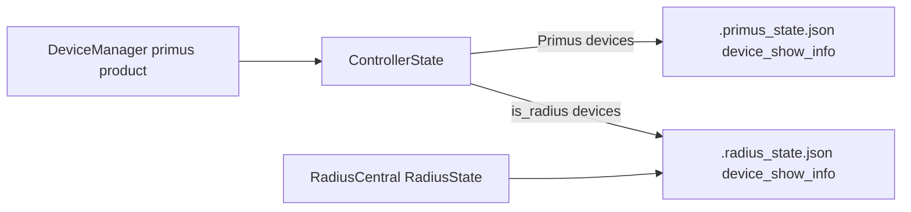

# Radius + DeviceManager Integration (V5)

This document describes the shipped V5 integration that lets **DeviceManager** monitor **Primus and Radius receivers on the same network**, while **RadiusCentral** gains the same identity editing UX as PrimusCentral. PrimusCentral and RadiusCentral firmware panels remain product-scoped; only DeviceManager exposes a mixed Primus/Radius firmware upload flow.

For the pre-implementation firmware audit, see [RADIUS_FIRMWARE_AUDIT.md](RADIUS_FIRMWARE_AUDIT.md).

## Architecture



- **DeviceManager** always runs `product: primus` with `ControllerState`, but discovery now accepts **both** `PV3CAP1` Primus nodes and `PVRAD1` Radius nodes.
- Radius records in `ControllerState` carry `is_radius: true` and **never** get an `ArtNetSender` — no DMX is streamed to them, including under `monitor_only`.
- **Show info** (character/performer names) routes through `show_info_store.py`:
  - Primus devices → `.primus_state.json` `device_show_info`
  - Radius devices in mixed monitoring → `.radius_state.json` `device_show_info`
- **RadiusCentral** continues to use `RadiusState` for its own device list; show-info edits there also persist in `.radius_state.json`.
- **PTR track telemetry** (UDP 6455) is handled by `PrimusTelemetryListener` on the primus-product server so DeviceManager can show `current_track` on Radius cards without a second listener.

## Firmware (`V5/Arduino/radius_receiver/`)

Unified **V1 + V2** sketch with board selection via `radius_upload.sh`:

| Profile | Board | Upload flag |
|---------|-------|-------------|
| `radius_v1` | HUZZAH32 + Music Maker | `-rv1` |
| `radius_v2` | ESP32-S3 Reverse TFT + Music Maker | `-rv2` |

**Identity:** Node Report uses `PVRAD1|B:v1` or `B:v2` (not `PV3CAP1`), so senders can sort product type reliably.

**Show info:** ArtShowInfo opcode `0x8210` with NVS `characterName` / `performerName`, matching Primus firmware pattern. Feature flag `S` is advertised in `F:RIHAS` (rename, IP, hello/test-tone, show-info).

**Branch extras ported:** OSC listener, Marius BLE (`marius.h`), ArtAudioStatus `0x8302`, ST7789 display on V2, PTR + PFP telemetry, FTP creds `radius`/`radius`.

**Compile check:**

```bash
./V5/Arduino/radius_upload.sh -rv1 --compile
./V5/Arduino/radius_upload.sh -rv2 --compile
```

Primus firmware (`primusV3_receiver/`) is unchanged in behavior aside from the independent 3.13.0 show-info default seeding constants used as the Radius port reference.

## DeviceManager UI

**Monitor tab** (`index-devices.html`, `app-devices.js`, `device-conn.js`):

- Cards grouped into **Primus** and **Radius** sections, each with Attention / Online / Offline subsections.
- Summary strip shows total online, Primus count, and Radius count.
- Character-name filter chips are split into separate **Primus** and **Radius** rows.
- Per-device helpers (not session product):
  - `monitorProductLabel(dev)` → `"Primus"` / `"Radius"`
  - `showInfoEnabled(dev)` → Radius devices or Primus nodes with `capabilities.show_info`
  - `helloDevice()` → identify flash for Primus, test tone (+ volume) for Radius
- **Radius cards** hide universe, receive mode, outputs, virtual resolution, and battery. They still show character/performer/device name, IP, status/FPS, Hello, firmware version, and static IP config when expanded.

**Firmware tab** — mixed upload panel:

- Primus / Radius **family toggle**, then per-family board toggle (V1/V2/V3 or V1/V2).
- Receive-mode NVS overrides are shown only for the Primus family.
- Client passes `scope=mixed` to `/api/firmware/status` and `POST /api/firmware/jobs`.

## RadiusCentral UI

The device sidebar (`index.html`) now includes the PrimusCentral-style **identity block** (character + performer editing) when `showInfoEnabled(dev)` is true. Hello uses the shared `helloDevice()` path with per-device volume for Radius nodes.

## Backend API

### Mixed firmware scope

| Call | Scope | Profiles visible |
|------|-------|------------------|
| `GET /api/firmware/status` | default `product` | Product-filtered (unchanged for PrimusCentral / RadiusCentral) |
| `GET /api/firmware/status?scope=mixed` | `mixed` | All five: `v1`, `v2`, `v3`, `radius_v1`, `radius_v2` |
| `POST /api/firmware/jobs` | optional `"scope": "mixed"` | Validates profile against mixed catalog |

`setup_tools` with `scope=mixed` installs libraries for all registered profiles.

### Mixed device discovery

On `product: primus`, `is_compatible_node()` accepts `PVRAD1` nodes. Sync (`POST /api/devices/sync`) adds them with `is_radius: true`. Show-info discovery queries run when `capabilities.show_info` or `device_class == "radius"`.

### Show-info persistence

`POST /api/device_show_info` on a device with `is_radius: true` in `ControllerState` writes to `.radius_state.json` via `show_info_store.py` and sends ArtShowInfo to the receiver when supported.

## Tests

```bash
python3 -m unittest discover -s V5/sender/tests
```

Key new/extended coverage:

- `test_mixed_device_discovery.py` — primus product accepts PVRAD1
- `test_device_show_info.py` — Radius show-info writes `.radius_state.json`
- `test_firmware_profiles.py` — `scope=mixed`, `radius_v2`, receive-mode gating per family
- `test_artnet_radius.py` — `F:RIHAS` + `show_info` in capability parse

## Quick validation

1. Run DeviceManager: `python3 V5/sender/run_devices.py`
2. Confirm Primus and Radius nodes appear in separate Monitor sections without DMX side effects.
3. Edit character/performer on a Radius card — restart sender; names should restore from `.radius_state.json`.
4. RadiusCentral sidebar: same identity fields editable for connected Radius nodes.
5. DeviceManager Firmware tab: toggle Primus vs Radius, compile/upload with the expected `upload.sh` / `radius_upload.sh` routing.
