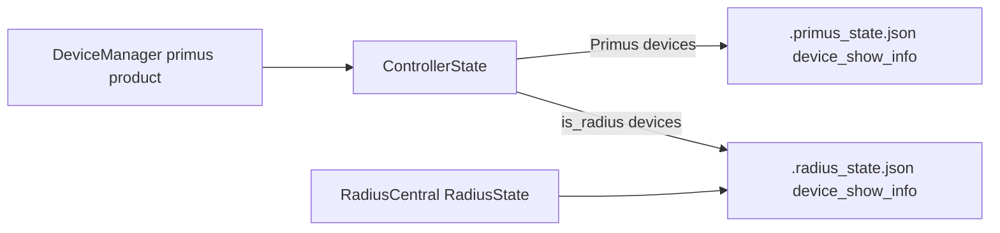

# Radius + DeviceManager Integration (V5)

This document describes the shipped V5 integration that lets **DeviceManager** monitor **Primus and Radius receivers on the same network**, while **RadiusCentral** gains the same identity editing UX as PrimusCentral. PrimusCentral and RadiusCentral firmware panels remain product-scoped; only DeviceManager exposes a mixed Primus/Radius firmware upload flow.

## Architecture



- **DeviceManager** always runs `product: primus` with `ControllerState`; its discovery accepts **both** `PV3CAP1` Primus nodes and `PVRAD1` Radius nodes. It scans **both 6454 + 6456** (`_discovery_ports()` → `discover_artnet_nodes_multi`) and routes per-device management to each device's port (`_device_port(dev)`), so it discovers and manages both families after the 6456 move, and its `PrimusTelemetryListener` now ingests **0x8302** (plus PTR fallback) so Radius **now-playing** works event-driven.
- Radius records in `ControllerState` carry `is_radius: true` and **never** get an `ArtNetSender` — no DMX is streamed to them, including under `monitor_only`.
- **Show info** (character/performer names) routes through `show_info_store.py`:
  - Primus devices → `.primus_state.json` `device_show_info`
  - Radius devices in mixed monitoring → `.radius_state.json` `device_show_info`
- **RadiusCentral** continues to use `RadiusState` for its own device list; show-info edits there also persist in `.radius_state.json`.
- **Playback telemetry (RadiusCentral)** is now event-driven **`0x8302` ArtAudioStatus** (UDP 6455): `RadiusTelemetryListener` ingests it (plus `PBT` battery), exposing `current_track`/`playback_state` on the device. The periodic PTR heartbeat was removed from firmware (PTR functions retained as a fallback). **DeviceManager** ingests the same `0x8302` in `PrimusTelemetryListener` (with a PTR fallback branch), so its Radius now-playing is event-driven too.

## Concurrency limitation — RadiusCentral cannot run alongside PrimusCentral

**Status:** known limitation as of v0.97, verified on macOS. Read this before
changing how RadiusCentral launches.

PrimusCentral and DeviceManager share one backend on purpose — DeviceManager is
a frontend on the Primus server, not a second process. RadiusCentral is a
different *product*, and there is no working co-existence story for it. Starting
it while a Primus Central is running does **not** fail; it silently attaches to
the wrong backend:

```text
$ python3 V5/sender/run_radius.py --no-browser
Radius Central V5: Central already running on port 8080 (backend: primus)
  View URL: http://127.0.0.1:8080/radius
```

Observed against that Primus backend:

| Probe | Result |
|-------|--------|
| `GET /radius` | `200` — the UI loads and looks healthy |
| `GET /api/state` | Primus state: clips/looks/cues, **no** audio/ftp/track keys |
| `GET /api/audio/cue_map` | `400` |
| `radius_state.py` / `.radius_state.json` | never loaded |

### Two independent causes

1. **The launcher does not check product.** `find_running_central_server()` in
   `central_launcher.py` returns any live Central regardless of product, and
   `candidate_ports()` probes the requested port, then the registry port, then
   `8080` — so even `--port 8081` attaches to a Primus server on 8080.
   `central_server.json` stores a single `{port, product, pid}`: it is a
   one-server registry, not a multi-server one.

2. **The Watch lane is a single-owner socket.** The telemetry listener binds
   `0.0.0.0:6455` with `SO_REUSEADDR` only. A second backend cannot take it:

   ```text
   second bind on 6455 FAILED: [Errno 48] Address already in use
   ```

   This is the deeper blocker. Fixing only cause 1 moves the failure rather than
   removing it, and adding `SO_REUSEPORT` would be *worse* — telemetry would be
   split arbitrarily between two processes with no way to route a packet to the
   backend that owns that device.

### Preferred direction

Make RadiusCentral a **third frontend on one shared backend**, the same way
DeviceManager already is, with the single 6455 listener demuxing by magic:
`PST`/`PFP` → Primus, `PTR` → Radius. This removes the port conflict by
construction instead of working around it, and the precedent already exists —
see the `PrimusTelemetryListener` note above, which handles Radius `PTR` on the
primus-product server today precisely to avoid a second listener.

The real work is that the backend selects one product globally through
`sender_product()` and would need to hold `ControllerState` and `RadiusState`
at once.

Independently and cheaply: the launcher should **fail loudly on product
mismatch** rather than attaching. The current failure is invisible, which is the
worst property it could have.

## Firmware (`V5/Arduino/radius_receiver/`)

Unified **V1 + V2** sketch, built through the consolidated `upload.sh`
(`radius_upload.sh` was removed):

| Profile | Board | Upload flag | BLE (Marius) |
|---------|-------|-------------|--------------|
| `radius_v1` | HUZZAH32 + Music Maker | `-rv1` | no — stubbed; NimBLE off (−264 KB flash) |
| `radius_v2` | ESP32-S3 Reverse TFT + Music Maker | `-rv2` | yes |

**Identity:** Node Report uses `PVRAD1|B:v1` or `B:v2` (not `PV3CAP1`), so senders can sort product type reliably.

**Show info:** ArtShowInfo opcode `0x8210` with NVS `characterName` / `performerName`, matching Primus firmware pattern. Feature flag `S` is advertised in `F:RIHAS` (rename, IP, hello/test-tone, show-info).

**Branch extras ported:** OSC listener + cue-map test-fire, Marius BLE
(`marius.h`, **V2-only**), event-driven ArtAudioStatus `0x8302`, ST7789 display
on V2, cue-map **live-reload**, **device-side cue delay**, **rv1 battery
telemetry**, dedicated Art-Net **port 6456**, PFP telemetry, FTP creds
`radius`/`radius`. Capability tag is `F:RIHAS` on V2 and `F:RIHASB` on V1 (`B` = battery).

**Compile check:**

```bash
./V5/Arduino/upload.sh -rv1 --compile
./V5/Arduino/upload.sh -rv2 --compile
```

Primus firmware (`primusV3_receiver/`) is unchanged in behavior aside from the independent 3.13.0 show-info default seeding constants used as the Radius port reference.

## DeviceManager UI

**Monitor tab** (`index-devices.html`, `app-devices.js`, `device-conn.js`):

- Cards grouped into **Primus** and **Radius** sections, each with Attention / Online / Offline subsections.
- Summary strip shows total online, Primus count, and Radius count.
- Character-name filter chips are split into separate **Primus** and **Radius** rows.
- Per-device helpers (not session product):
  - `monitorProductLabel(dev)` → `"Primus"` / `"Radius"`
  - `showInfoEnabled(dev)` → Radius devices or Primus nodes with `capabilities.show_info`
  - `helloDevice()` → identify flash for Primus, test tone (+ volume) for Radius
- **Radius cards** hide universe, receive mode, outputs, and virtual resolution. They show character/performer/device name, IP, status/FPS, Hello, firmware version, static IP config when expanded, and — on **rv1 (HUZZAH32)** — a **battery** chip (rv2 battery not yet available).

**Firmware tab** — mixed upload panel:

- Primus / Radius **family toggle**, then per-family board toggle (V1/V2/V3 or V1/V2).
- Receive-mode NVS overrides are shown only for the Primus family.
- Client passes `scope=mixed` to `/api/firmware/status` and `POST /api/firmware/jobs`.

## RadiusCentral UI

The device sidebar (`index.html`) now includes the PrimusCentral-style **identity block** (character + performer editing) when `showInfoEnabled(dev)` is true. Hello uses the shared `helloDevice()` path with per-device volume for Radius nodes.

## Backend API

### Mixed firmware scope

| Call | Scope | Profiles visible |
|------|-------|------------------|
| `GET /api/firmware/status` | default `product` | Product-filtered (unchanged for PrimusCentral / RadiusCentral) |
| `GET /api/firmware/status?scope=mixed` | `mixed` | All five: `v1`, `v2`, `v3`, `radius_v1`, `radius_v2` |
| `POST /api/firmware/jobs` | optional `"scope": "mixed"` | Validates profile against mixed catalog |

`setup_tools` with `scope=mixed` installs libraries for all registered profiles.

### Mixed device discovery

On `product: primus`, `is_compatible_node()` accepts `PVRAD1` nodes. Sync (`POST /api/devices/sync`) adds them with `is_radius: true`. Show-info discovery queries run when `capabilities.show_info` or `device_class == "radius"`.

### Show-info persistence

`POST /api/device_show_info` on a device with `is_radius: true` in `ControllerState` writes to `.radius_state.json` via `show_info_store.py` and sends ArtShowInfo to the receiver when supported.

## Tests

```bash
python3 -m unittest discover -s V5/sender/tests
```

Key new/extended coverage:

- `test_mixed_device_discovery.py` — primus product accepts PVRAD1
- `test_device_show_info.py` — Radius show-info writes `.radius_state.json`
- `test_firmware_profiles.py` — `scope=mixed`, `radius_v2`, receive-mode gating per family
- `test_artnet_radius.py` — `F:RIHAS` + `show_info` in capability parse

## Quick validation

1. Run DeviceManager: `python3 V5/sender/run_devices.py`
2. Confirm Primus and Radius nodes appear in separate Monitor sections without DMX side effects.
3. Edit character/performer on a Radius card — restart sender; names should restore from `.radius_state.json`.
4. RadiusCentral sidebar: same identity fields editable for connected Radius nodes.
5. DeviceManager Firmware tab: toggle Primus vs Radius, compile/upload — all profiles now route through the single `upload.sh`.

## Status & Roadmap (V5 forward-port — July 2026)

The `radius-central` July work is now forward-ported onto V5 (branch
`radius-v5-forwardport`), additive w.r.t. the Primus/DeviceManager side. Both
`radius_v1` and `radius_v2` compile; the V5 sender suite is green.

### Completed
- **Event-driven telemetry** — `0x8302` ArtAudioStatus is the primary playback
  signal; periodic PTR heartbeat removed (PTR retained as fallback).
  `RadiusTelemetryListener` merges 0x8302 + PBT with no staleness window.
- **Dedicated Art-Net port 6456** — Radius listens/replies/receives on 6456.
  Discovery is per-product via `server.py::_discovery_port()` (RadiusCentral →
  6456, PrimusCentral → 6454), and audio/FTP/rename/IP-config/show-info route to
  6456 for Radius. **Breaking: devices must be reflashed.**
- **VS1053 hardening** — 254-powerdown clamp, `_muteChip` cache invalidation,
  full `reset()` + sample-rate detection, delay-after-stop, audioLoop ordering,
  no-write-after-sineTest — pinned by `test_firmware_source_contracts.py`.
- **Cue-map push pipeline** — derive per-device `/cues.json` from the sheet,
  preview + push to the fleet (⇪ Cue Maps modal), OSC test-fire; firmware
  **live-reload** applies pushed maps without a reboot.
- **Device-side cue delay** — non-blocking per-cue delay scheduled on the device
  (`delay_ms` wire field + `dispatchCue`), authored via the "Dly" cue field.
- **rv1 battery telemetry** — HUZZAH32 A13, `PBT` on UDP 6455, `F:…B`, tick gated
  on `!audioIsPlaying()`; battery chip on Radius cards.
- **Build consolidation** — one `upload.sh` (`-rv1`/`-rv2`); `radius_upload.sh` removed.
- **NimBLE off V1** — Marius is V2-only, stubbed on V1 → ~264 KB flash reclaimed
  (V1 now 79% used).
- **DeviceManager mixed-port support** — `_discovery_ports()` scans both 6454 +
  6456 for the primus product (`discover_artnet_nodes_multi` merges by IP), and
  `_device_port(dev)` routes per-device management (rename / show-info / IP) to
  6456 for Radius, 6454 for Primus. Restores DeviceManager finding *and*
  managing both families after the 6456 move.
- **DeviceManager Radius now-playing (0x8302)** — `PrimusTelemetryListener`
  now parses `0x8302` ArtAudioStatus (reusing the `_record_ptr` path) with a PTR
  fallback branch, so DeviceManager shows event-driven Radius `current_track` /
  `playback_state` after the firmware heartbeat was removed. Pinned by
  `test_radius_pipeline.py::PrimusListenerAudioStatus`.

### Future todos (post-merge)
- **rv2 battery** — needs a MAX17048 fuel gauge over I2C (hardware first).
- **Audio cue fade in/out** — designed (schema-first firmware ramp), not built.
- **Per-project file structure** — scope `audio_cues.json` + device listing per
  project instead of global.

### Merge
PR `radius-v5-forwardport` → `main` with npuckett. Port 6456 is **breaking**
(fleet reflash). Validate on hardware first: discovery on 6456, 0x8302
now-playing, VS1053 sample-rate/`reset()`, cue delay, live-reload, rv1 battery.
