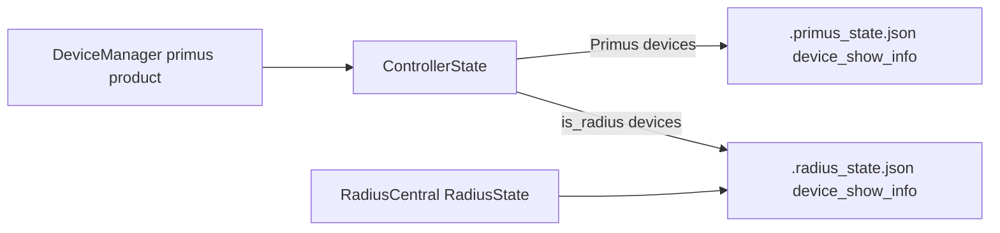

# Radius + DeviceManager Integration (V5)

This document describes the shipped V5 integration that lets **DeviceManager** monitor **Primus and Radius receivers on the same network**, while **RadiusCentral** gains the same identity editing UX as PrimusCentral. PrimusCentral and RadiusCentral firmware panels remain product-scoped; only DeviceManager exposes a mixed Primus/Radius firmware upload flow.

For the pre-implementation firmware audit, see [RADIUS_FIRMWARE_AUDIT.md](RADIUS_FIRMWARE_AUDIT.md).

## Architecture



- **DeviceManager** always runs `product: primus` with `ControllerState`, but discovery now accepts **both** `PV3CAP1` Primus nodes and `PVRAD1` Radius nodes.
- Radius records in `ControllerState` carry `is_radius: true` and **never** get an `ArtNetSender` — no DMX is streamed to them, including under `monitor_only`.
- **Show info** (character/performer names) routes through `show_info_store.py`:
  - Primus devices → `.primus_state.json` `device_show_info`
  - Radius devices in mixed monitoring → `.radius_state.json` `device_show_info`
- **RadiusCentral** continues to use `RadiusState` for its own device list; show-info edits there also persist in `.radius_state.json`.
- **PTR track telemetry** (UDP 6455) is handled by `PrimusTelemetryListener` on the primus-product server so DeviceManager can show `current_track` on Radius cards without a second listener.

## Concurrency limitation — RadiusCentral cannot run alongside PrimusCentral

**Status:** known limitation as of v0.97, verified on macOS. Read this before
changing how RadiusCentral launches.

PrimusCentral and DeviceManager share one backend on purpose — DeviceManager is
a frontend on the Primus server, not a second process. RadiusCentral is a
different *product*, and there is no working co-existence story for it. Starting
it while a Primus Central is running does **not** fail; it silently attaches to
the wrong backend:

```text
$ python3 V5/sender/run_radius.py --no-browser
Radius Central V5: Central already running on port 8080 (backend: primus)
  View URL: http://127.0.0.1:8080/radius
```

Observed against that Primus backend:

| Probe | Result |
|-------|--------|
| `GET /radius` | `200` — the UI loads and looks healthy |
| `GET /api/state` | Primus state: clips/looks/cues, **no** audio/ftp/track keys |
| `GET /api/audio/cue_map` | `400` |
| `radius_state.py` / `.radius_state.json` | never loaded |

### Two independent causes

1. **The launcher does not check product.** `find_running_central_server()` in
   `central_launcher.py` returns any live Central regardless of product, and
   `candidate_ports()` probes the requested port, then the registry port, then
   `8080` — so even `--port 8081` attaches to a Primus server on 8080.
   `central_server.json` stores a single `{port, product, pid}`: it is a
   one-server registry, not a multi-server one.

2. **The Watch lane is a single-owner socket.** The telemetry listener binds
   `0.0.0.0:6455` with `SO_REUSEADDR` only. A second backend cannot take it:

   ```text
   second bind on 6455 FAILED: [Errno 48] Address already in use
   ```

   This is the deeper blocker. Fixing only cause 1 moves the failure rather than
   removing it, and adding `SO_REUSEPORT` would be *worse* — telemetry would be
   split arbitrarily between two processes with no way to route a packet to the
   backend that owns that device.

### Preferred direction

Make RadiusCentral a **third frontend on one shared backend**, the same way
DeviceManager already is, with the single 6455 listener demuxing by magic:
`PST`/`PFP` → Primus, `PTR` → Radius. This removes the port conflict by
construction instead of working around it, and the precedent already exists —
see the `PrimusTelemetryListener` note above, which handles Radius `PTR` on the
primus-product server today precisely to avoid a second listener.

The real work is that the backend selects one product globally through
`sender_product()` and would need to hold `ControllerState` and `RadiusState`
at once.

Independently and cheaply: the launcher should **fail loudly on product
mismatch** rather than attaching. The current failure is invisible, which is the
worst property it could have.

## Firmware (`V5/Arduino/radius_receiver/`)

Unified **V1 + V2** sketch with board selection via `radius_upload.sh`:

| Profile | Board | Upload flag |
|---------|-------|-------------|
| `radius_v1` | HUZZAH32 + Music Maker | `-rv1` |
| `radius_v2` | ESP32-S3 Reverse TFT + Music Maker | `-rv2` |

**Identity:** Node Report uses `PVRAD1|B:v1` or `B:v2` (not `PV3CAP1`), so senders can sort product type reliably.

**Show info:** ArtShowInfo opcode `0x8210` with NVS `characterName` / `performerName`, matching Primus firmware pattern. Feature flag `S` is advertised in `F:RIHAS` (rename, IP, hello/test-tone, show-info).

**Branch extras ported:** OSC listener, Marius BLE (`marius.h`), ArtAudioStatus `0x8302`, ST7789 display on V2, PTR + PFP telemetry, FTP creds `radius`/`radius`.

**Compile check:**

```bash
./V5/Arduino/radius_upload.sh -rv1 --compile
./V5/Arduino/radius_upload.sh -rv2 --compile
```

Primus firmware (`primusV3_receiver/`) is unchanged in behavior aside from the independent 3.13.0 show-info default seeding constants used as the Radius port reference.

## DeviceManager UI

**Monitor tab** (`index-devices.html`, `app-devices.js`, `device-conn.js`) — **performer-first layout**:

- Cards are grouped **by performer**: one section per performer (heading = performer name, character name(s), device count, worst-status rollup badge), with that performer's Primus card first and Radius card beside it. Most performers wear both a Primus and a Radius device, so the two cards sit side by side (`.dm-performer-grid` constrains card width).
- A single **Unassigned** section at the bottom collects devices with no performer name. Setting a performer name on a card (inline edit, unchanged) moves it into that performer's group — that move is the expected feedback for assignment.
- **Stable positions:** performers sort alphabetically (`localeCompare`, sensitivity `base`); within a performer, Primus first then Radius, tiebreak on the stable device key (`deviceKey(dev)` in `device-conn.js`: `device_uid` → `ip` → name). Battery level, online/offline flapping, transport errors, and sync order never reorder cards. Status is shown **in place**: the `.dm-status-pill`, the per-performer rollup badge, the summary strip, a per-card left-border tint (`.dm-card-attention/-online/-offline`), and an optional "Attention only" filter toggle. Alpine `:key`s are the stable device/section keys (never array index), and card expand state is keyed by device key with a `syncExpandedCards` reconciler.
- **Edit identity** on a performer heading opens a panel with Character + Performer fields (datalists of existing names); saving issues one `POST /api/device_show_info` per device in the group (`{device, character_name, performer_name}`), skipping locked/unsupported devices. Group re-sorting is frozen while the editor is open. Renaming the performer moves the whole group; clearing it moves the devices to Unassigned.
- Summary strip shows total online, Primus count, and Radius count. Character-name filter chips remain split into **Primus** and **Radius** rows.
- Per-device helpers (not session product):
  - `monitorProductLabel(dev)` → `"Primus"` / `"Radius"`
  - `showInfoEnabled(dev)` → Radius devices or Primus nodes with `capabilities.show_info`
  - `helloDevice()` → identify flash for Primus, test tone (+ volume) for Radius
- **Radius cards** hide universe, receive mode, outputs, virtual resolution, and battery. They still show character/performer/device name, IP, status/FPS, Hello, firmware version, and static IP config when expanded. Expanded cards also show `monitorHardwareLabel(dev)` in the footer.
- The mobile view (`/devices?mode=mobile`) uses the same performer grouping, read-only (no identity editing).

**Firmware tab** — mixed upload panel:

- Primus / Radius **family toggle**, then per-family board toggle (V1/V2/V3 or V1/V2).
- Receive-mode NVS overrides are shown only for the Primus family.
- Client passes `scope=mixed` to `/api/firmware/status` and `POST /api/firmware/jobs`.

## RadiusCentral UI

The device sidebar (`index.html`) now includes the PrimusCentral-style **identity block** (character + performer editing) when `showInfoEnabled(dev)` is true. Hello uses the shared `helloDevice()` path with per-device volume for Radius nodes.

## Backend API

### Mixed firmware scope

| Call | Scope | Profiles visible |
|------|-------|------------------|
| `GET /api/firmware/status` | default `product` | Product-filtered (unchanged for PrimusCentral / RadiusCentral) |
| `GET /api/firmware/status?scope=mixed` | `mixed` | All five: `v1`, `v2`, `v3`, `radius_v1`, `radius_v2` |
| `POST /api/firmware/jobs` | optional `"scope": "mixed"` | Validates profile against mixed catalog |

`setup_tools` with `scope=mixed` installs libraries for all registered profiles.

### Mixed device discovery

On `product: primus`, `is_compatible_node()` accepts `PVRAD1` nodes. Sync (`POST /api/devices/sync`) adds them with `is_radius: true`. Show-info discovery queries run when `capabilities.show_info` or `device_class == "radius"`.

### Show-info persistence

`POST /api/device_show_info` on a device with `is_radius: true` in `ControllerState` writes to `.radius_state.json` via `show_info_store.py` and sends ArtShowInfo to the receiver when supported.

## Tests

```bash
python3 -m unittest discover -s V5/sender/tests
```

Key new/extended coverage:

- `test_mixed_device_discovery.py` — primus product accepts PVRAD1
- `test_device_show_info.py` — Radius show-info writes `.radius_state.json`
- `test_firmware_profiles.py` — `scope=mixed`, `radius_v2`, receive-mode gating per family
- `test_artnet_radius.py` — `F:RIHAS` + `show_info` in capability parse

## Quick validation

1. Run DeviceManager: `python3 V5/sender/run_devices.py`
2. Confirm devices group by performer in the Monitor tab (a performer's Primus and Radius cards side by side; devices without a performer under **Unassigned**) without DMX side effects, and that card positions do not move when a device goes offline or its battery drops.
3. Edit character/performer on a Radius card (or via a performer heading's **Edit identity**) — restart sender; names should restore from `.radius_state.json`. Assigning a performer to an Unassigned card should move it into that performer's group.
4. RadiusCentral sidebar: same identity fields editable for connected Radius nodes.
5. DeviceManager Firmware tab: toggle Primus vs Radius, compile/upload with the expected `upload.sh` / `radius_upload.sh` routing.
