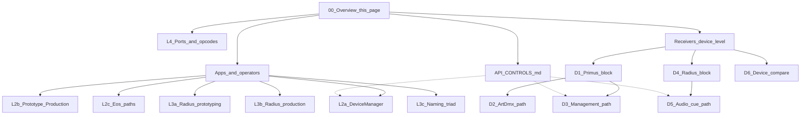

# Primus + Radius — linked systems diagrams

Start here. One overview map, then drill into component diagrams. Device **API controls** live in [API_CONTROLS.md](API_CONTROLS.md).

**Sources:** Primus = V5 management-v2 · Radius = `radius-central` (Art-Net **:6456**) · ignore Radius narrative inside V5.

---

## Overview map



| Focus | Open | PNG |
|-------|------|-----|
| **System context** | [Workbook L0](Primus-Radius-Systems.drawio) · [outline §1](SYSTEMS_OUTLINE.md#1-shared-thesis) | [L0-context.png](png/L0-context.png) |
| **Apps & data stores** | outline §2–3 · workbook L1 | [L1-containers.png](png/L1-containers.png) |
| **DeviceManager params** | outline · workbook L2a · [API §1–2](API_CONTROLS.md#1-shared-discovery--identity-both-products) | [L2a](png/L2a-devicemanager-params.png) |
| **Prototype → production** | workbook L2b · [API gates](API_CONTROLS.md#gates-read-first) | [L2b](png/L2b-prototype-production.png) |
| **Eos control** | workbook L2c · [API §2.4](API_CONTROLS.md#24-artdmx-show-path--related-http) | [L2c](png/L2c-eos-control.png) |
| **Radius prototyping** | workbook L3a · [API §3](API_CONTROLS.md#3-radius-only--audio--ftp--cues) | [L3a](png/L3a-radius-prototyping.png) |
| **Radius production** | workbook L3b | [L3b](png/L3b-radius-production.png) |
| **Naming triad** | workbook L3c | [L3c](png/L3c-naming-model.png) |
| **Ports / opcodes** | workbook L4 · [API wire columns](API_CONTROLS.md) | [L4](png/L4-protocol-ports.png) |
| **System compare** | workbook L5 | [L5](png/L5-comparison.png) |
| **Primus device block** | workbook D1 · outline §4.1 | [D1](png/D1-primus-device-block.png) |
| **Primus ArtDmx path** | workbook D2 | [D2](png/D2-primus-artdmx-path.png) |
| **Primus management path** | workbook D3 · [API §2.3](API_CONTROLS.md#23-management-protocol-operations-0x8140--reply-0x8141) | [D3](png/D3-primus-management-path.png) |
| **Radius device block** | workbook D4 · outline §4.4 | [D4](png/D4-radius-device-block.png) |
| **Radius audio/cue path** | workbook D5 · [API §3.1–3.3](API_CONTROLS.md#31-artaudiocmd-0x8300) | [D5](png/D5-radius-audio-cue-path.png) |
| **Device compare** | workbook D6 | [D6](png/D6-device-comparison.png) |
| **Full API tables** | **[API_CONTROLS.md](API_CONTROLS.md)** | — |

---

## Recommended reading order

1. **L0** — who talks to whom on the LAN  
2. **API_CONTROLS** — skim gates + “which API for what?”  
3. **L2a + D1–D3** — Primus monitoring/commissioning and how the node works  
4. **L2c** — Eos beside DeviceManager  
5. **L3a–b + D4–D5** — Radius prototyping vs production and how the node works  
6. **L4 / L5 / D6** — ports and side-by-side summary  

---

## Artifacts

| File | Role |
|------|------|
| [README.md](README.md) | **Hub** (this page) — linked diagram set |
| [API_CONTROLS.md](API_CONTROLS.md) | Full Primus + Radius control tables |
| [SYSTEMS_OUTLINE.md](SYSTEMS_OUTLINE.md) | Narrative detail + Mermaid sources |
| [Primus-Radius-Systems.drawio](Primus-Radius-Systems.drawio) | diagrams.net workbook (page **00 Index** + L* + D*) |
| [L0-companion-poster.excalidraw](L0-companion-poster.excalidraw) | Workshop poster |
| [png/](png/) · [svg/](svg/) | Slide exports |

Open the `.drawio` in [diagrams.net](https://app.diagrams.net/). First page **00 Index** mirrors this hub.

```bash
python3 docs/systems/_generate_drawio.py
python3 docs/systems/_export_mermaid.py
```
