# Primus + Radius Systems Outline

Narrative companion to the **linked diagram set**.

| Start here | |
|------------|--|
| **Hub / map** | [README.md](README.md) |
| **API controls (full tables)** | [API_CONTROLS.md](API_CONTROLS.md) |
| **Workbook** | [Primus-Radius-Systems.drawio](Primus-Radius-Systems.drawio) (page 00 Index → L* → D*) |
| **Exports** | [png/](png/) · [svg/](svg/) |

When a diagram mentions a control, jump to [API_CONTROLS.md](API_CONTROLS.md) for method, opcode, and lock rules.

### Linked diagram map

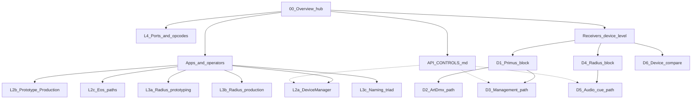

## Sources of truth

| System | Source | Ignore |
|--------|--------|--------|
| **Primus** | `V5/` on branch `npuckett-create-v5-tree` — management-v2, DeviceManager, prototype/production | Radius docs/UI inside V5 for the Radius narrative |
| **Radius** | `origin/radius-central` (V4 Radius track + cue/OSC/6456 work) | Treating V5’s Radius bundle as authoritative |
| **Shared context** | Main / `V4` DeviceManager mixed-monitoring docs for cohabitation | — |

V5 may not yet be on `main`. This outline treats V5 as the Primus feature head.

---

## 1. Shared thesis

Primus and Radius are complementary costume systems on one trusted show LAN:

- **Primus** — LED receivers driven by ArtDmx (from PrimusCentral *or* an external console such as ETC Eos). Commissioning and monitoring are separate from pixel transport.
- **Radius** — audio receivers with SD/FTP + ArtAudioCmd. Content and cues are authored in RadiusCentral; playback can also be triggered by device-local cue maps / OSC.

They share Art-Net discovery vocabulary, identity fields, IP tooling, and (via DeviceManager on the Primus backend) a mixed monitor — but they do **not** share pixel/audio transport, and Radius never receives ArtDmx.

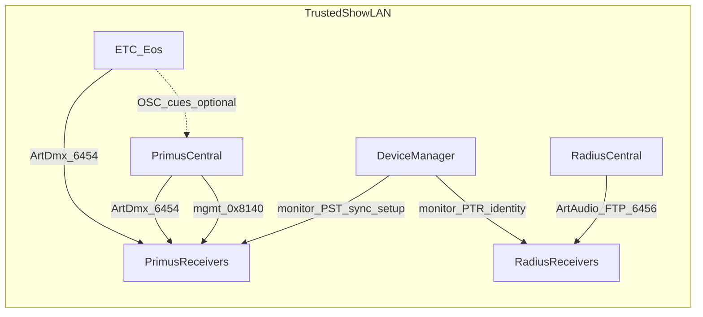

---

## 2. Primus system (V5)

### 2.1 Components

| Component | Role |
|-----------|------|
| **DeviceManager** | Monitoring-first board (`/devices`): auto-sync, setup, firmware (`scope=mixed`), Settings. Prefer `monitor_only` when it owns the backend — safe beside Eos/another sender. |
| **PrimusCentral** | Show-control: Look Designer, Cue Controller, ArtDmx loop, OSC in, firmware/settings. Same management setup surface as DM via shared `device-conn.js`. |
| **Primus receivers** | ESP32 NeoPixel nodes (`v1`/`v2`/`v3`), `PV3CAP1`, management `0x8140`/`0x8141`, unified status `PST` on UDP 6455. |
| **External console (Eos)** | Production pixel driver via ArtDmx to universes; optional OSC into PrimusCentral for cue/blackout. |

### 2.2 Network / protocol stack

- **UDP 6454 Art-Net:** ArtPoll/ArtPollReply, ArtDmx (pixels), legacy config opcodes, management request/reply `0x8140`/`0x8141`.
- **UDP 6455:** `PST` v1 telemetry (explicit unicast target only — never learned from ArtDmx/Eos).
- **HTTP (local sender):** Alpine UIs + JSON management facade.
- **OSC (into PrimusCentral):** `/primus/cue/*`, blackout — same path as Cue Controller.

### 2.3 DeviceManager — controllable parameters

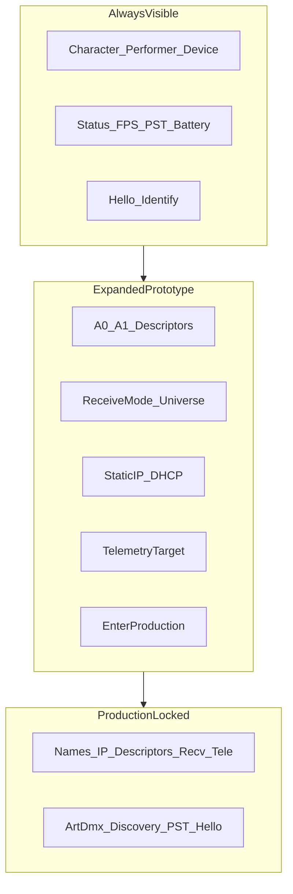

**Always visible / monitor**

- Character name, Performer name, Device (technical) name
- Online/attention status, FPS / PST health, battery (profile-dependent)
- IP + universe summary, product tag, firmware version
- Hello (identify flash)
- Mobile/Tablet View: read-only monitor + Hello (LAN bind when DM owns backend)

**Expanded card / commissioning (management-capable Primus; prototype mode)**

- Output slots **A0 / A1** (always present; Off is valid): built-in type, custom strip/grid descriptor, or preset
  - Strip: physical px 1–170, virtual send px
  - Grid: rows/cols, row/column-major, progressive/serpentine, start corner, virtual px
- Receive mode: split vs combined + base universe
- Static IP / DHCP
- Telemetry target (`teleTarget`) — usually “Use sender IP”; clear = no PST
- Production enter / recovery guidance
- Bulk rename / bulk apply output or receive-mode (group-scoped)
- Firmware flash + Settings (network interface)

**Locked in production (receiver `opMode`)**

Locks: technical + show names, IP, output descriptors, receive mode/base universe, telemetry target.  
Still active: ArtDmx, discovery, PST (if targeted), Hello.  
Recovery: V3 = D1 long-press; V1/V2 = boot-window unlock (first 60s).

**Radius cards in DM (monitor only)**

Identity, IP, status/FPS/track, Hello=test tone, static IP when expanded — **no** universes/outputs/management-v2.

### 2.4 Prototyping vs production

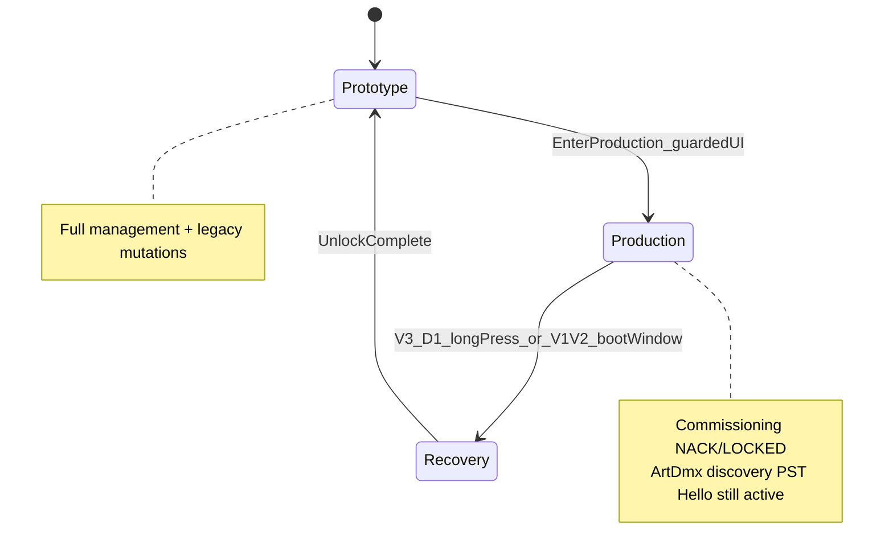

| | **Prototype** (default) | **Production** |
|--|-------------------------|----------------|
| Purpose | Commission wiring, universes, names, PST | Freeze commissioning for show |
| Editable | Full management + legacy mutations | Commissioning writes → `NACK/LOCKED` |
| Show output | PrimusCentral and/or Eos ArtDmx | Same — lock does **not** own ArtDmx |
| Monitoring | DM / PST | Same |
| Exit | N/A | Physical/boot recovery only |

Commissioning workflow: flash → discover → names → IP/universe → A0/A1 descriptors → PST target → verify Hello/ArtDmx/PST → **enter production**.

Management path:

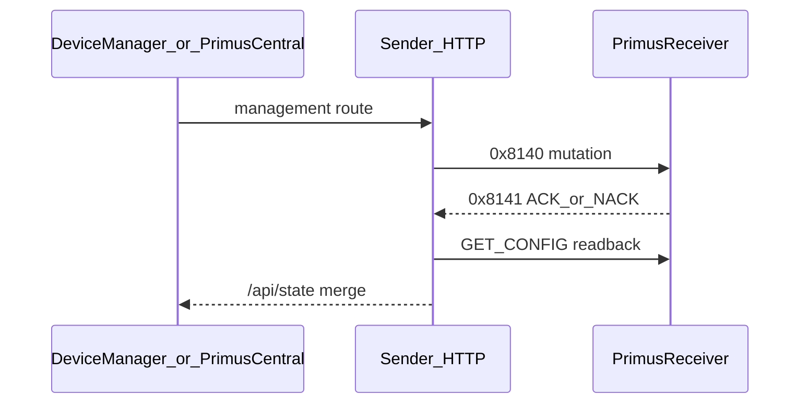

### 2.5 Control via Eos

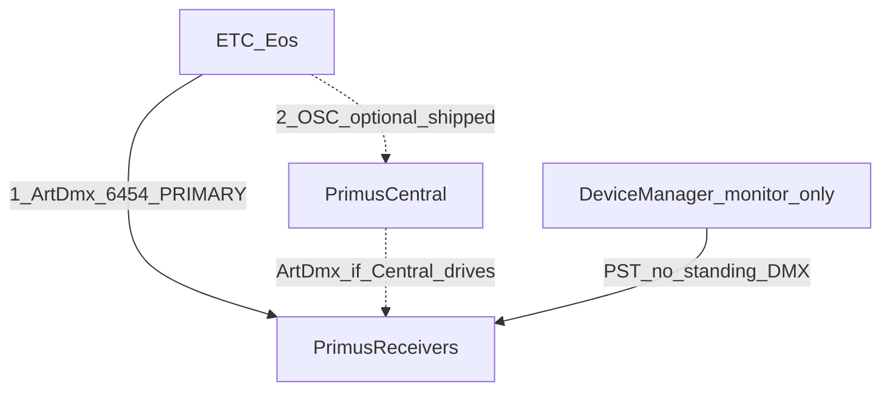

1. **Pixel path (primary):** Eos patches Primus nodes as Art-Net fixtures and sends ArtDmx. DeviceManager stays `monitor_only` (or PrimusCentral is not driving those IPs). PST target stays explicit so Eos traffic never steals monitoring.
2. **Cue path (optional):** Eos OSC Tx → `/primus/cue/goto`, `/primus/blackout`, … into PrimusCentral (Option 1 — works today).

**Future (not shipped):** channel-level Art-Net-in to PrimusCentral, brightness busking, sACN bridges.

---

## 3. Radius system (`radius-central`)

### 3.1 Components

| Component | Role |
|-----------|------|
| **RadiusCentral** | Audio SPA: Audio file manager, Audio Cues, Cue Map, Net Log, Firmware, Settings. |
| **Radius receivers** | HUZZAH32 / S3 TFT + Music Maker (`rv1`/`rv2`), `PVRAD1`, SD + FTP, ArtAudioCmd `0x8300`, ArtFtpCmd `0x8301`, ArtAudioStatus `0x8302`, ArtShowInfo `0x8210`. |
| **DeviceManager (Primus backend)** | Mixed monitor/identity for Radius; not the Radius show-control surface. |

**Branch transport note:** `radius-central` moves Radius Art-Net to **UDP 6456** so audio control can coexist with Primus/Eos on 6454.

### 3.2 Prototyping methods


- Discover/connect; rename; static IP/DHCP
- **Audio panel:** browse SD (FTP), upload/rename/delete/mkdir, play/loop/stop/pause/volume, Hello test tone
- **Project library:** import WAVs into sender `audio/`
- **Cue Map editor:** edit device `/cues.json`
- **Net Log:** live Art-Net/FTP/audio trace
- **Firmware panel:** flash rv1/rv2 with WiFi/name overrides
- Identity via ArtShowInfo (character/performer) — Primus three-field naming

### 3.3 Production-mode functions (operational)

Radius does **not** yet implement Primus-style receiver `opMode` production lock. “Production” means the show-ready workflow:


| Function | What it does |
|----------|----------------|
| **Audio Cues sheet** | Numbered cues with **per-device** actions (play/loop/stop, file, volume, duration) |
| **Sync All (push)** | Stop nodes → FTP missing library files to SD |
| **Fire cue** | Sender fans out ArtAudioCmd (and/or cue-number cmds) per IP |
| **Device cue map** | Offline/console-style `play_cue` / `loop_cue` from SD `/cues.json` |
| **OSC fire / test** | Branch: OSC dispatch + cue-map push/live reload |
| **Cue boards** | Named saved sets of production cues |
| **Telemetry** | PTR current track (+ PFP/battery where present) |

**Assumed naming:** Character · Performer · Device (technical) — ArtShowInfo `0x8210` + `.radius_state.json`. Diagrams treat this as the target identity model even where UI/firmware coverage is still catching up.

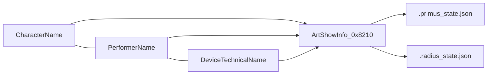

---

## 4. Device-level detail (how a receiver works)

System diagrams above show apps and networks. This section is **inside one costume node**.

### 4.1 Primus receiver block

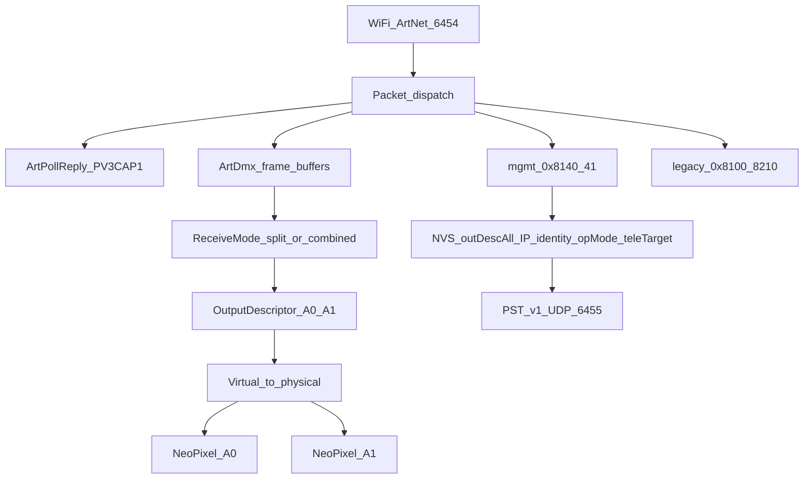

**Critical path (show):** ArtDmx → slot buffers (physical wire-order RGB) → virtual→physical upscale → NeoPixel `show()`. Grid metadata does not reorder bytes. Brightness is sender-scaled RGB only.

**Control plane:** management `GET_CONFIG` / `SET_*` → validate → NVS CRC commit → ACK/NACK. Production `opMode` locks commissioning; ArtDmx/discovery/PST/Hello stay live.

**Profiles:** v1 HUZZAH32 · v2 Feather · v3 S3 TFT + A0/A1 PCB (battery/buttons/TFT vary).

### 4.2 Primus ArtDmx data plane


| Receive mode | Layout |
|--------------|--------|
| Split (default) | A0 = base universe, A1 = base+1 (even if a slot is Off) |
| Combined | One universe; A0 bytes then A1; ≤170 virtual px total |

### 4.3 Primus management operations (on-device)

| Op | Name | Device effect |
|----|------|----------------|
| `0x01` | GET_CONFIG | Authoritative snapshot |
| `0x10` | SET_OUTPUT_DESCRIPTORS | Atomic A0+A1 descriptors |
| `0x11` | SET_TELEMETRY_TARGET | Unicast PST target or clear |
| `0x12` | SET_OPERATING_MODE | Enter production |
| `0x13` | SET_RECEIVE_CONFIG | Split/combined + base universe |
| `0x14` | SET_IP_CONFIG | DHCP / static |
| `0x15` | SET_IDENTITY | Technical + show names |
| `0x16` | BOOT_WINDOW_UNLOCK | V1/V2 recovery (first 60s) |

### 4.4 Radius receiver block

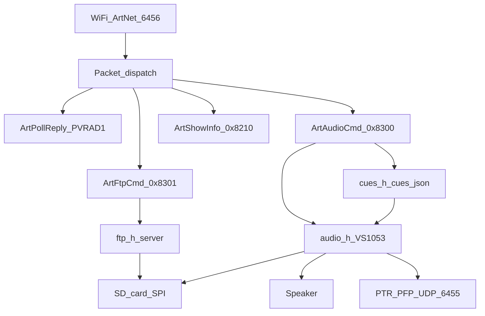

**Critical path (show):** `audioUpdate()` → VS1053 + SD SPI. Art-Net is a bounded drain, not the hot path.

**Loop priority:** audio → FTP (if active) → Art-Net batch → WiFi check → buttons → PTR/PFP.

**SD contention:** `sdBusy` while playing → FTP refused; play stops FTP first; FTP start stops audio first.

### 4.5 Radius audio / cue data plane

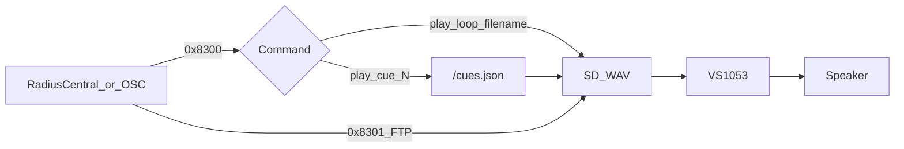

| cmd | Behavior on device |
|-----|--------------------|
| 0–3 | stop / play / loop / pause |
| 4 | volume |
| 5 | test_tone (Hello) |
| 6–7 | play_cue / loop_cue → lookup `/cues.json` (≤64 entries; map load at boot/reload) |

### 4.6 One-node comparison

| | Primus node | Radius node |
|--|-------------|-------------|
| Tag | `PV3CAP1` | `PVRAD1` |
| Ports | :6454 + PST :6455 | :6456 + PTR/PFP :6455 |
| Critical path | ArtDmx → NeoPixel | audioUpdate → VS1053/SD |
| Persistent show media | NVS descriptors (pixels streamed live) | SD WAVs + `/cues.json` |
| Outputs | A0/A1 LEDs | Speaker |
| Lock | Firmware `opMode` | Operational workflow only |
| Identify | LED flash | Test tone |
| Never | Audio / FTP / SD show files | ArtDmx / LEDs |

---

## 5. Similarities vs differences

**Shared**

- Trusted LAN; Art-Net discovery language; capability tags (`PV3CAP1` vs `PVRAD1`)
- Identity triad + IP config + Hello (flash vs tone)
- DeviceManager as cross-product monitor
- Packaged Central apps + firmware upload panels
- Explicit separation of commissioning/monitoring from show transport

**Different**

| | Primus | Radius |
|--|--------|--------|
| Payload | ArtDmx RGB | WAV / cue commands |
| Show authoring | Clips → Looks → Cues (or Eos looks) | Library → Audio Cues → Sync; optional SD cue map |
| Commissioning lock | Firmware prototype/production | Operational discipline only (for now) |
| Telemetry | `PST` (explicit target) | `PTR` (+ status/battery variants) |
| Control port | 6454 (+ 6455 PST) | Branch: **6456** Art-Net (+ 6455 telemetry) |
| Eos role | Direct ArtDmx (± OSC cues) | Not a pixel peer; may share LAN only |

Protocol / port map (workbook L4):

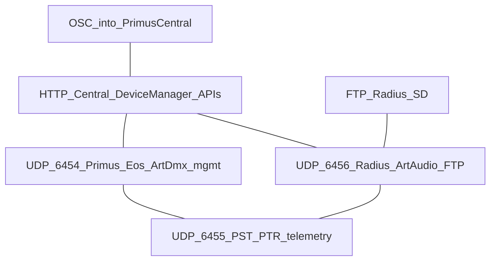

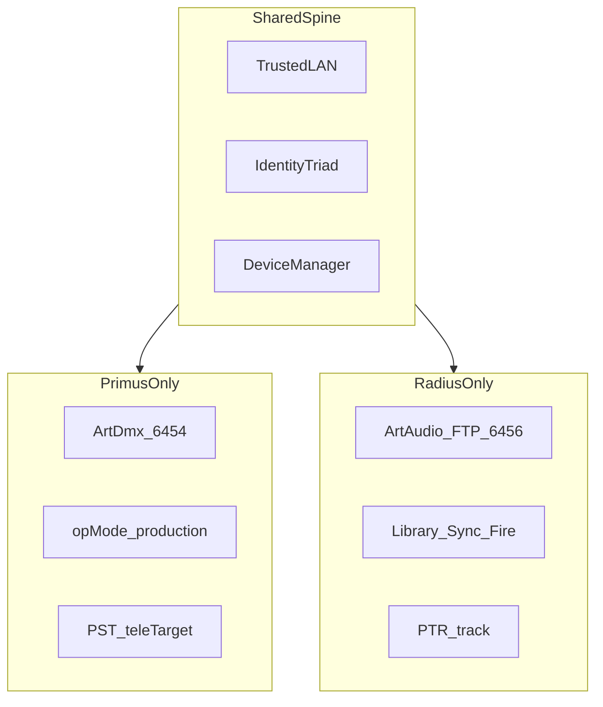

---

## 6. Diagram inventory

Canonical linked list: **[README.md](README.md)**. Workbook page **00 Index** matches that hub.

| Page | Stem | Job | API ref |
|------|------|-----|---------|
| 00 | `00-overview-map` | Linked index | [API_CONTROLS](API_CONTROLS.md) |
| L0 | `L0-context` | LAN who→whom | — |
| L1 | `L1-containers` | Apps + stores | — |
| L2a | `L2a-devicemanager-params` | DM params | §1–2 |
| L2b | `L2b-prototype-production` | opMode state machine | Gates, §2.3 |
| L2c | `L2c-eos-control` | Eos ArtDmx + OSC | §2.4 |
| L3a | `L3a-radius-prototyping` | RadiusCentral tech | §3 |
| L3b | `L3b-radius-production` | Show workflow | §3.3 |
| L3c | `L3c-naming-model` | Identity triad | §1 |
| L4 | `L4-protocol-ports` | Ports/opcodes | wire cols |
| L5 | `L5-comparison` | System swimlanes | §4 quick |
| D1–D3 | `D1`…`D3` | Primus device | §2 |
| D4–D5 | `D4`…`D5` | Radius device | §3 |
| D6 | `D6-device-comparison` | One-node compare | §4 quick |

Workbook: [`Primus-Radius-Systems.drawio`](Primus-Radius-Systems.drawio). Poster: [`L0-companion-poster.excalidraw`](L0-companion-poster.excalidraw).

---

## 7. Assumptions

1. Primus feature head = **V5 management-v2**.
2. Radius feature head = **`radius-central`**, including Art-Net **6456** and cue/OSC production pipeline.
3. Eos = **direct ArtDmx to receivers** + **optional OSC Option 1**; deeper Art-Net-in / sACN marked future.
4. Radius “production mode” = **show workflow**, not Primus `opMode` lock.
5. Naming = **Primus three-field model for both**.
6. V5 Radius content is **out of scope** for the Radius narrative.

---

## 8. Regenerating artifacts

```bash
# Rebuild the draw.io workbook from the generator
python3 docs/systems/_generate_drawio.py

# Rebuild Mermaid PNG/SVG exports
python3 docs/systems/_export_mermaid.py
```

Open `Primus-Radius-Systems.drawio` in diagrams.net for further visual polish or PDF export of the full workbook.
